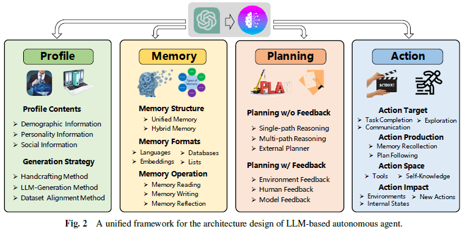
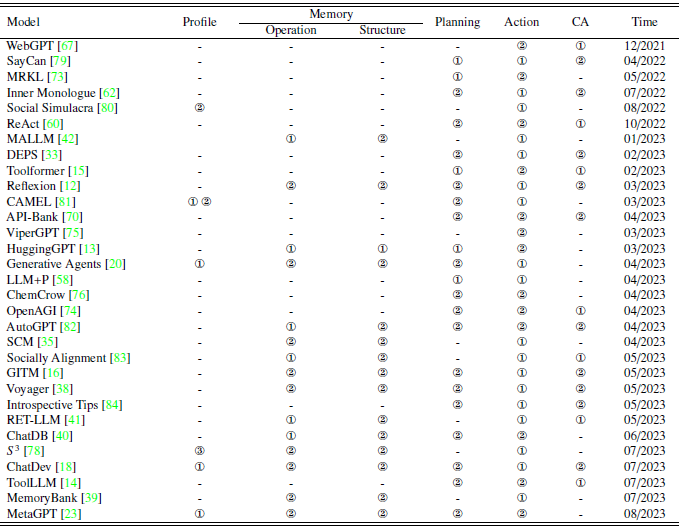
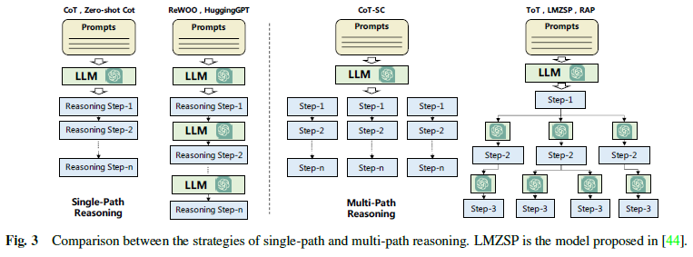
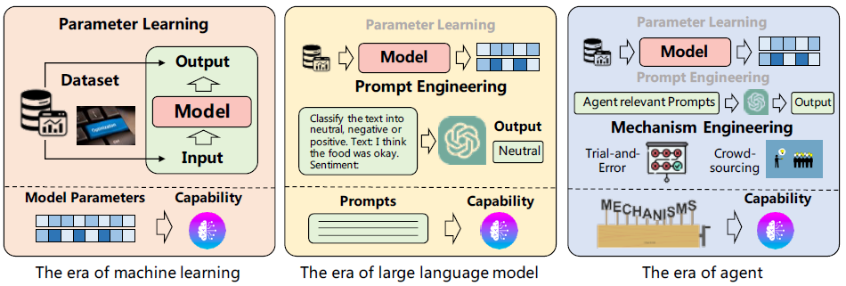
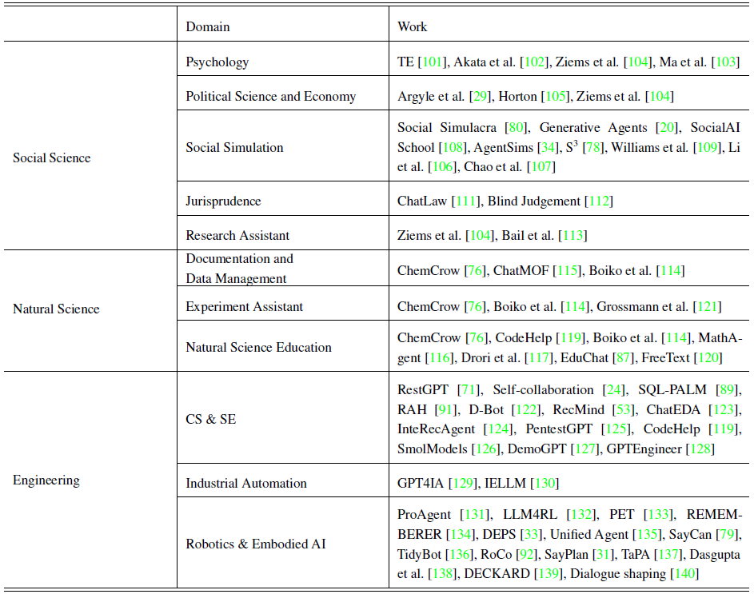
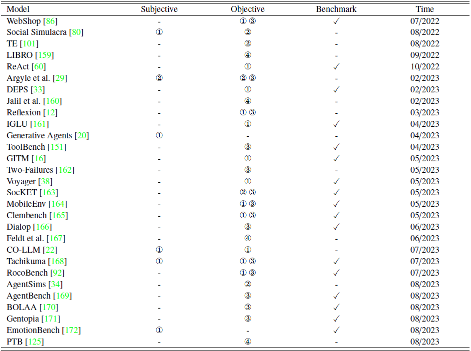

# Title
A Survey on Large Language Model based Autonomous Agents

# Authors
LeiWang, Chen Ma, Xueyang Feng, Zeyu Zhang, Hao Yang, Jingsen Zhang, Zhi-Yuan Chen, Jiakai Tang, Xu Chen, Yankai Lin, Wayne Xin Zhao, ZheweiWei, Ji-RongWen

# Publication Year
August 2023

# Journal
Frontiers Comput. Sci. 22 August 2023

# Citation
754 (accessed on Dec 27, 2024)

# 背景及び先行研究との違い
Autonomous Agentsに関するレビューアーティクル

# 研究内容
LLMベースのautonomous agentsを規定するフレーム枠として以下を提示。


# Agent Architecture Design
Table 1 For the profile module, we use ①, ② and ③ to represent the handcrafting method, LLM-generation method, and dataset alignment method respectively. For the memory module, we focus on the implementation strategies for memory operation and memory structure. For memory operation, we use ① and ② to indicate that the model only has read/write operations and has read/write/reflection operations, respectively. For memory structure, we use ① and ② to represent unified and hybrid memories, respectively. For the planning module, we use ① and ② to represent planning w/o feedback and w/
feedback, respectively. For the action module, we use ① and ② to represent that the model does not use tools and use tools, respectively. For the agent capability acquisition (CA) strategy, we use ① and ② to represent the methods with and without fine-tuning, respectively. “-” indicates that the corresponding content is not explicitly discussed in the paper.


## Profiling Module
プロファイルとして、コーディング、先生、ドメイン専門家などのロールを担う。エージェントプロファイルとして、年齢・性別・キャリア・物理的情報を含み、エージェントのパーソナリティ・ソーシャルデータ・エージェント間のインタラクションをリフレクションする。特に、人間の認知プロセスを学習させる場合は、心理的な情報が不可欠となる。
プロファイルが決まった後は、特定のプロファイルを示すエージェントの作り方であり、以下の3つの方法に分かれる。

- **Handcrafting Method**：マニュアルでエージェントのプロファイルを規定する方法であり、”You are an outgoing person”や"You are an introvered person"として規定する
    >Zhang H, Du W, Shan J, Zhou Q, Du Y, Tenenbaum J B, Shu T, Gan C. Building cooperative embodied agents modularly with large language models. arXiv preprint arXiv:2307.02485, 2023
    >
    >Hong S, Zheng X, Chen J, Cheng Y, Wang J, Zhang C, Wang Z, Yau S K S, Lin Z, Zhou L, others . Metagpt: Meta programming for multi-agent collaborative framework. arXiv preprint arXiv:2308.00352, 2023
    >
    >Qian C, Cong X, Yang C, Chen W, Su Y, Xu J, Liu Z, Sun M. Communicative agents for software development. arXiv preprint arXiv:2307.07924, 2023

- **LLM-generation Method**：LLMにより自動的にプロファイルを生成するもの。まずプロファイル生成ルールを定め、エージェントのプロファイルの構成と属性を定める。そのうえで、オプション的に複数シードとfew-shotによりエージェントを生成する。例えば、RecAgent論文では、年齢、性別、特徴、映画の嗜好性などの属性について、数人分のエージェントのプロファイルを作成し、その後ChatGPTで、シード情報を変えることにより、より多くのエージェントの生成を行っている。
    >Wang L, Zhang J, Chen X, Lin Y, Song R, Zhao W X, Wen J R. Recagent: A novel simulation paradigm for recommender systems. arXiv preprint arXiv:2306.02552, 2023

- **Dataset Alignment Method**：リアルワールドデータを用いて、エージェントをあらインさせる方法。例えば、American National Election Studiesを用いて、参加者の人種・宗教、性別、年齢、居住地のデモグラを用いてGPT3にロールを与えるもの。
    > Argyle L P, Busby E C, Fulda N, Gubler J R, Rytting C, Wingate D. Out of one, many: Using language models to simulate human samples. Political Analysis, 2023, 31(3): 337–351

## Memory Module
メモリーとは、エージェントが外界から得られる情報や将来のアクションを促すための記録されたメモリの活用をするために使われるものである。メモリは、経験・self-evolve・アクションを、一貫性があり、リーズナブルで、効果的な形でガイドするものとなる。
- **Memory Structures**：人間の認知科学に照らしたもの。人間の記憶は、一時的な情報を維持するための短期記憶と、長期間にわたって統合される長期記憶に分類される。エージェントの世界では、二つの方法により短期・長期記憶のメモリ活用がなされる。
  1. **Unified Memory**：短期記憶のみ捉えるもの。メモリ情報はプロンプトに直接書き込まれる
  2. **Hybrid Memory**：短期記憶と長期記憶を捉える。短期記憶は、エージェントの現在のシチュエーションに関するコンテキスト情報をメモリ化する。Generative Agentでは、長期記憶は、現在のイベントからretrieveされるエージェントの過去の行動と思考となる。AgentSimsでも、短期・長期記憶が扱われており、短期記憶はプロンプトで提供される。一方、長期記憶は、エージェントの短期記憶がエンベディングされ、ベクターデータベースに保存される。エージェントが過去の記憶を呼び起こすときに、ベクターデータベースから、エンベディングの類似度を用いて、retrieveするものである。GITMでは、短期記憶は現在のtrajectoryを保存し、長期記憶は成功した過去のtrajectoriesからサマリされたreference plansを保存する。Reflexionでは、短期的なsliding windowにより直近のフィードバックを捉え、persistentな長期記憶をcondensed insightsとして統合する。この短期・長期記憶の組み合わせが、直近の経験をハイレベルの抽象化に使うことができる。
      >Park J S, O’Brien J, Cai C J, Morris M R, Liang P, Bernstein M S. Generative agents: Interactive simulacra of human behavior. In: Proceedings of the 36th Annual ACM Symposium on User Interface Software and Technology. 2023, 1–22
      
      > <font color = 'lightblue'>Lin J, Zhao H, Zhang A, Wu Y, Ping H, Chen Q. Agentsims: An open-source sandbox for large language model evaluation. arXiv preprint arXiv:2308.04026, 2023</font>
      >
      > Zhu X, Chen Y, Tian H, Tao C, Su W, Yang C, Huang G, Li B, Lu L, Wang X, others . Ghost in the minecraft: Generally capable agents for open-world enviroments via large language models with text-based knowledge and memory. arXiv preprint arXiv:2305.17144, 2023
      >
      > <font color = 'lightblue'>Shinn N, Cassano F, Gopinath A, Narasimhan K, Yao S. Reflexion: Language agents with verbal reinforcement learning. Advances in Neural Information Processing Systems, 2024, 36</font>

- **Memory Formats**: 上記で述べたMemory Structureだけではなく、メモリのフォーマットも論点に上がる。フォーマットとしては、自然言語メモリ、エンベディングメモリがある。
  1. **Natural Language**: エージェントの行動や観察を自然言語のフォーマットとするもの。Reflexionでは、経験的なフィードバックを自然言語のsliding windowで保存している。Voyagerでは、Minecraftゲームにおけるスキルを自然言語で保存している。
      > Shinn N, Cassano F, Gopinath A, Narasimhan K, Yao S. Reflexion: Language agents with verbal reinforcement learning. Advances in Neural Information Processing Systems, 2024, 36 
      >
      > Wang G, Xie Y, Jiang Y, Mandlekar A, Xiao C, Zhu Y, Fan L, Anandkumar A. Voyager: An open-ended embodied agent with large language models. arXiv preprint arXiv:2305.16291, 2023

  2. **Embeddings**：メモリインフォメーションはエンベディングベクターで保存される。
      > Zhong W, Guo L, Gao Q, Wang Y. Memorybank: Enhancing large language models with long-term memory. arXiv preprint arXiv:2305.10250, 2023


  3. **Databases**: メモリ情報がデータベースに保管され、エージェントが効率的にメモリを取得する
      > Hu C, Fu J, Du C, Luo S, Zhao J, Zhao H. Chatdb: Augmenting llms with databases as their symbolic memory. arXiv preprint arXiv:2306.03901, 2023

  4. **Structured Lists**：リスト形式でメモリ情報が保管される。GITMでは、サブゴールのアクションリストを階層化ツリー構造で保管している。Ret-LLMでは、自然言語をトリプレットに変換し、メモリとして保存している。
      > Zhu X, Chen Y, Tian H, Tao C, Su W, Yang C, Huang G, Li B, Lu L, Wang X, others . Ghost in the minecraft: Generally capable agents for open-world enviroments via large language models with text-based knowledge and memory. arXiv preprint arXiv:2305.17144, 2023
      >
      > <font color = 'lightblue'>Modarressi A, Imani A, Fayyaz M, Schütze H. Retllm: Towards a general read-write memory for large language models. arXiv preprint arXiv:2305.14322, 2023</font>

- **Memory Operations**: Memory Operationsとは、エージェントが外的環境とインタラクトするにあたって、重要な知識を獲得し、蓄積し、利用するのに必要な不可欠な要素。そのためには3つのクリティカルなメモリオペレーションがあり、Memory Reading, Memory Writing, Memory Reflectionである。

    - 1. **Memory Reading**: Memory Readingとは、エージェントのアクションを高めるために、メモリーから重要な情報を抜き出すことである。記憶の抜出には、3つのクライテリアがあり、recency, relevance, importanceである。
    $$ m=arg min_{m∈M}{\alpha}s^{rec}(q,m)+{\beta}s^{rel}(q,m)+{\gamma}s^{imp}(m)$$
    where,  
            q=query  
            M=set of memories  
            $s^{rec}$, $s^{rel}$, $s^{imp}$ = scoring fuctions for measuring the recency, relevance, and importance of the memory $m$  
    $s^{rec}$, $s^{rel}$, $s^{imp}$は、様々な手法で実行され、LSH, ANNOY, HNSW, FAISSがある。なお、式にあるとおり、重要度は、メモリーの特徴を反映するものであり、queryには依存しない。$\alpha$, $\Beta$, $\gamma$はバランシングパラメータである。  
    多くのスタディでは、${\alpha}={\gamma}=0$とし、relevance scoreである$s^{rel}$のみをメモリーリーディングとして考慮している（下記、1, 2, 3, 4論文）。$\alpha=\beta=\gamma=1.0$とすると、均等ウェイトとなる（下記、5論文）
    >1. Zhu X, Chen Y, Tian H, Tao C, Su W, Yang C, Huang  G, Li B, Lu L, Wang X, others . Ghost in the minecraft:  Generally capable agents for open-world enviroments  via large language models with text-based knowledge  and memory. arXiv preprint arXiv:2305.17144, 2023

    >2. Fischer K A. Reflective linguistic programming (rlp):  A stepping stone in socially-aware agi (socialagi).  arXiv preprint arXiv:2305.12647, 2023

    >3. Wang G, Xie Y, Jiang Y, Mandlekar A, Xiao C, Zhu  Y, Fan L, Anandkumar A. Voyager: An open-ended  embodied agent with large language models. arXiv  preprint arXiv:2305.16291, 2023

    >4. Modarressi A, Imani A, Fayyaz M, Schütze H. Retllm:  Towards a general read-write memory for large  language models. arXiv preprint arXiv:2305.14322,
    2023

    >5. Park J S, O’Brien J, Cai C J, Morris M R, Liang P,  Bernstein M S. Generative agents: Interactive simulacra  of human behavior. In: Proceedings of the 36th  Annual ACM Symposium on User Interface Software  and Technology. 2023, 1–22
    
    - 2. **Memory Writing**: Memory Writingは、外的環境においてメモリに情報を書き出す行為である。Writingの課題は二つあり、①どのように過去の類似した記憶を保存するか（i.e., Memory Duplicated）と②ストレージリミットに達したときにどのように情報を削除するか（i.e., Memory Overflow）である。
      1. **Memory Duplicated**: 類似情報を統合するもの。同じサブゴールに対して成功した一連のアクションをリスト化し、リストのサイズがN(=5)を超えた場合、LLMを用いてa unified plan solutionとして統合される。元々の一連のアクションは、新しく生成されたものに置き換えられる（下記論文1）。Augmented LLMでは、重複した情報をcount accumulationを通じて集約し、redundutなストレージを避ける(下記論文2)
      2. **Memory Overflow**: メモリがフルになったときに、過去のメモリを削除するもの。例えば、ChatDBでは、ユーザーコマンドにより削除し（下記論文3）、RET-LLMでは、メモリ用に固定サイズのバッファーを使い、First-in-First_outの考えで、古い情報を上書きしていく（下記論文4）。
   
        >1. Zhu X, Chen Y, Tian H, Tao C, Su W, Yang C, Huang  G, Li B, Lu L, Wang X, others . Ghost in the minecraft:  Generally capable agents for open-world enviroments  via large language models with text-based knowledge and memory. arXiv preprint arXiv:2305.17144, 2023

        >2. Schuurmans D. Memory augmented large language  models are computationally universal. arXiv preprint  arXiv:2301.04589, 2023
        
        >3. Hu C, Fu J, Du C, Luo S, Zhao J, Zhao H. Chatdb: Augmenting  llms with databases as their symbolic memory.  arXiv preprint arXiv:2306.03901, 2023
        
        >4. Modarressi A, Imani A, Fayyaz M, Schütze H. Retllm:  Towards a general read-write memory for large  language models. arXiv preprint arXiv:2305.14322,  2023
<br>
    - 3. **Memory Reflection**: Memory Reflectionは、自身の認知的、感情的、行動的プロセスを認識し、評価することができ能力を示すものである。目的は、エージェントが独立的に各種情報をサマリし、推測することができ能力を持つことである。Generative Agents（下記論文1）では、エージェントが過去の経験をメモリから抽象的なインサイトを導出し過去の経験をサマライズしている。具体的には、エージェントは、直近の記憶について3つのキークエスチョンを生成す。次に、それらのクエスチョンは、関連する情報を得るのに使われ、エージェントは5つのインサイトを引き出し、それらはハイレベルなアイデアを反映することとなる。例えば、以下の3つの文章は、
        ```
        > “Klaus Mueller is writing a research paper”  
        > “Klaus Mueller is engaging with a librarian to further his research”  
        > “Klaus Mueller is conversing with Ayesha Khan about his research”
        ```  

        、以下のハイレベル抽象化を行う 

        ``` 
        > “Klaus Mueller is dedicated to his research”.
        ```

        また、抽象化は、階層的に発生し、既存のインサイトを用いてインサイトが階層的に生成される。
        
        GITM（下記論文2）ではサブゴールの成功を達成したアクションがリストにストアされる。リストが5つの要素を超える場合、エージェントは共通し抽象化したパターンをサマライズし、それら要素をリプレースする。

        ExpeL（下記論文3）では、reflectionのため、2つのアプローチが提案されている。第一に、エージェントは同一のタスクにおける一連の成功・失敗のを比較し、次に、一連の成功したアクションコレクションから経験値を引き出すことをしている。

        > 1. Park J S, O’Brien J, Cai C J, Morris M R, Liang P, Bernstein M S. Generative agents: Interactive simulacra of human behavior. In: Proceedings of the 36th Annual ACM Symposium on User Interface Software
        and Technology. 2023, 1–22

        > 2. Zhu X, Chen Y, Tian H, Tao C, Su W, Yang C, Huang  G, Li B, Lu L, Wang X, others . Ghost in the minecraft:  Generally capable agents for open-world enviroments  via large language models with text-based knowledge  and memory. arXiv preprint arXiv:2305.17144, 2023

        >3. Zhao A, Huang D, Xu Q, Lin M, Liu Y J, Huang G.  Expel: Llm agents are experiential learners. arXiv  preprint arXiv:2308.10144, 2023

## Planning Module
Planning ModuleはPlannning without FeedbackとPlanning with Feedbackに別れる


### Planning without Feedback
フィードバックは得ずに、アクションの結果が将来のアクションに影響を及ぼすもの。
1. **Single-path Reasoning**：最終的なタスクが複数の中間ステップに分解され、LLMはそれに従う。Chain of Thought, Zero-shot-CoT, Reprompting（プランを作る前に各ステップが必要な前提条件をクリアしているかチェックするもの）、ReWOO（エージェントが最初にプランを立て、外的環境からは独立して観察を行い、最終的に最終結果を得るのにそれらを組み合わせるもの）などがある
2. **Multi-path Reasoning**：Reasoningステップがツリー系の構造にオーガナイズされ最終計画を立案するもの。各中間ステップは、複数の関連するステップから構成される。Self-consistent CoTでは、最終回答を得るには複数の思考のパスがあると仮定し、まずCoTにより複数のReasoning Pathsを生成し、関連する回答を生成し、そのうえで、高頻度の回答が最終アウトプットとして選ばれる（論文1）。Tree of Thoughts (ToT)では、ツリーのノードが”thought”を表し、すなわち中間のreasoning stepとなる。最終ブランは、Breadth-first searchかdepth-first searchにより生成される（論文2）。AoTは、アルゴリズミックな例をプロンプトに使っており、LLMのクエリを1回か数回のみでよくなる。これは、Zero-shotを活用し、各プランニングステップにおいて、まず複数の考えうる次のステップを生成し、次に、許容されるアクションへの距離を基に最終的なプランが決定される（論文3）。
    >1. Wang X, Wei J, Schuurmans D, Le Q, Chi E, Narang  S, Chowdhery A, Zhou D. Self-consistency improves  chain of thought reasoning in language models. arXiv  preprint arXiv:2203.11171, 2022
    >2. Yao S, Yu D, Zhao J, Shafran I, Griffiths T, Cao Y,  Narasimhan K. Tree of thoughts: Deliberate problem  solving with large language models. Advances in Neural  Information Processing Systems, 2024, 36
    >3. Sel B, Al-Tawaha A, Khattar V, Wang L, Jia R, Jin  M. Algorithm of thoughts: Enhancing exploration  of ideas in large language models. arXiv preprint  arXiv:2308.10379, 2023
3. **External Planner**：LLM+Pでは、まずPlanning Domain Definition Languages(PDDL)によりタスクを分解し、external plannerがPDDLを扱う、そして、LLM により自然言語で最終リザルトを出すものである（論文1）。LLM-DPでは、LLMを活用し、観察、現在のworld state、目的をPDDLに転換し、external plannerに共有され、最終アクションに変換される（論文2）。
    >1. Liu B, Jiang Y, Zhang X, Liu Q, Zhang S, Biswas J,  Stone P. LLM+P: Empowering large language models  with optimal planning proficiency. arXiv preprint  arXiv:2304.11477, 2023
    >2. Dagan G, Keller F, Lascarides A. Dynamic planning with a llm. arXiv preprint arXiv:2308.06391, 2023

### Planning with Feedback
1. **Environmental Feedback**：外的環境からフィードバックを得るもの。ReAct、Voyager(プランを3種類の環境フィードバックにする)、Ghostなど。
2. **Human Feedback**：直接人間からフィードバックを得るもの。Monologueでは、シーン判定において人間から積極的にFBをもらい、エージェントは、人間からのフィードバックをプロンプトに変え、プランニングとリーズニングに反映させる（論文1）。
    >1. Huang W, Xia F, Xiao T, Chan H, Liang J, Florence P, Zeng A, Tompson J, Mordatch I, Chebotar  Y, others . Inner monologue: Embodied reasoning  through planning with language models. arXiv preprint  arXiv:2207.05608, 2022
3. **Model Feedback**：エージェント自身のフィードバックを用いる。Self-Refineメカニズム（論文1）では、output-feedback-refinementプロセスからなる。まず、エージェントはアウトプットを生成し、そのあと、LLMを用いて、アウトプットに対するFBとリファインのガイドをもらう。そのうえで、アウトプットするかFBをもらい、アウトプットが更新される。SelfCheckでは、エージェントが各ステージでリーズニングステップを評価し、アウトカムを比較した場合のエラーを修正する（論文2）。そのほか、ChatCoTやReflexionがある。
    >1. Madaan A, Tandon N, Gupta P, Hallinan S, Gao L,  Wiegreffe S, Alon U, Dziri N, Prabhumoye S, Yang  Y, others . Self-refine: Iterative refinement with selffeedback.  Advances in Neural Information Processing  Systems, 2024, 36
    >2. Miao N, Teh Y W, Rainforth T. Selfcheck: Using llms  to zero-shot check their own step-by-step reasoning.  In: The Twelfth International Conference on Learning  Representations. 2023

## Action Module
Action Moduleはエージェントの決定を特定のアウトカムに変換することを意味する。アクションは、プロファイル、メモリー、プランニングモジュールに影響される。Actionは、Action Goal, Action production (どのようにアクションが作られるか)、Action space（利用可能なアクションは何か）、Action impact（アクションの結果は何か）

### Action Goal
1. Task Completion
2. Communication
3. Environment Exploration

### Action Production
1. Action via Memory Recollection（Generative Agentsにあるようなメモリから掘り起こしてアクションを行うもの）
2. Action via Plan Following(Pre-generated plansに基づきアクションをするもの)

### Action Space
1. External Tools
   1. APIs(Hagging faceなど)
   2. Databases & Knowlege Bases（SQLなど）
   3. External Models(ViperGPTでは、Codexを使ってPythonコードをジェネレートする)
2. Internal knowledge of the LLMs 
   1. Planning Capability：LLMのプランニングの力を活用する。
   2. Conversation Capability
   3. Common Sense Understandings Capability

### Acxtion Impact
1. Changing Environments：エージェントがenvironment statesをインタラクトすることで、environmentsに変更を与えていくもの。
2. Altering Internal States：メモリのアップデートや新しいプランを作る際にエージェント自身が変わっていく。
3. Triggering New Actions：今のアクションが次のアクションをもたらすもの。

# Agent Capability Acquisition
## Capability Acquisition with Fine-tuning
タスクスペシフィックなデータセットを使ってモデルをファインチューニングすることでエージェントのケイパビリティを引き上げること。
### Fine-tuning with Human Annotated Datasets
人間がアノテーションしたデータを用いて、ファインチューニングするもの。CoHでは、人間のフィードバックをシンプルかつシンボリックな形で伝えて、詳細な比較情報として提供する。RET-LLMでは、自然言語をstructured memory informationに変換するため、人間がconstructしたデータセットを、"triplet-natural language"のペアに変換して活用される。WebShopでは、1.8百万あるamazon.comの商品を、シミュレーション上のEコマースウェブサイトとし、人間のショッピングしなりをを丁寧にデザインしている。著者は、このウェブサイトにおいて、13人の実際の人間のデータセットを作成し、これらのデータセットから、３つの手法として、ヒューリスティックなルール、imitation learning, reinforcement learningを学習させた。

> Liu H, Sferrazza C, Abbeel P. Chain of hindsight aligns language models with feedback. In: The Twelfth International Conference on Learning Representations. 2023
>
> Modarressi A, Imani A, Fayyaz M, Schütze H. Retllm: Towards a general read-write memory for large language models. arXiv preprint arXiv:2305.14322,
2023
>
> Yao S, Chen H, Yang J, Narasimhan K. Webshop: Towards scalable real-world web interaction with grounded language agents. Advances in Neural Information Processing Systems, 2022, 35: 20744–20757

### Fine-tuning with LLM Generated Datasets
人間によるファインチューニングは正確だがコストも時間もかかる。LLMが生成したデータは人間ほど完璧ではないものの、コストが安くサンプルと多く生成できる。ToolBenchでは、16,464のリアルワールドAPIからシナリオを作るものだが、得られたデータからLLamaをファインチューニングし、大幅なモデルの改善が得られた。他には、ソーシャルケイパビリティ論文が例である。

> Qin Y, Liang S, Ye Y, Zhu K, Yan L, Lu Y, Lin Y, Cong X, Tang X, Qian B, others . Toolllm: Facilitating large language models to master 16000+ real-world apis. arXiv preprint arXiv:2307.16789, 2023
>
>Liu R, Yang R, Jia C, Zhang G, Zhou D, Dai A M, Yang D, Vosoughi S. Training socially aligned language models in simulated human society. arXiv preprint arXiv:2305.16960, 2023

### Fine-tuning with Real-World Datasets
MIND2WEBでは、ウェブドメインにおけるエージェントのケイパビリティを高めるためリアルワールドデータセットを大量に取得した。2,000のオープンエンドなタスクを31ドメインの137のリアルワールドのウェブサイトから取得。このデータを用いて、Movie Discoveryとチケットブッキングを行うためのＬＬＭのファインチューニングをした。

> Deng X, Gu Y, Zheng B, Chen S, Stevens S, Wang B, Sun H, Su Y. Mind2web: Towards a generalist agent for the web. Advances in Neural Information Processing Systems, 2024, 36

## Capability Acquisition without Fine-tuning
従来型の機械学習では、データセットから学習をするが、LLMの場合はモデルは、モデルパラメータのトレーニング/ファインチューニング、または、プロンプトエンジニアリングによって学習をする。


Fig. 4 Illustration of transitions in strategies for acquiring model capabilities.

エージェントの場合は、3つの戦略によりモデルはCapabilityを獲得する。
1. **Model fine-tuning**
2. **Pronpt Engineering**: CoTでは、エージェントのcapabilityを獲得させるため、intermediate reasoning stepsをfew-shotで実施している。また、CoT-SC, ToT, RLPでは、エージェント自身とリスナーのメンタル状態に関するエージェントのbeliefをプロンプトすることで、エージェントのself-awarenessを高めることで、エージェントがよりエンゲージし、adaptiveな発話を獲得している。

> Liu H, Sferrazza C, Abbeel P. Chain of hindsight aligns language models with feedback. In: The Twelfth International Conference on Learning Representations. 2023
> 
> Wang X, Wei J, Schuurmans D, Le Q, Chi E, Narang S, Chowdhery A, Zhou D. Self-consistency improves chain of thought reasoning in language models. arXiv
preprint arXiv:2203.11171, 2022
>
>Yao S, Yu D, Zhao J, Shafran I, Griffiths T, Cao Y, Narasimhan K. Tree of thoughts: Deliberate problem solving with large language models. Advances in Neural Information Processing Systems, 2024, 36
>
>Fischer K A. Reflective linguistic programming (rlp): A stepping stone in socially-aware agi (socialagi). arXiv preprint arXiv:2305.12647, 2023

また、リスナーのターゲットメンタル状態を統合することも、エージェントのcapability獲得に有意に働いている。Retroformerでは、エージェントが過去の失敗をリフレクションし、そのリフレクションをLLMのプロンプトに統合することで、エージェントの将来アクションをガイドしている。加えて、Retroformerでは、強化学習も活用し、retrospective modelをイテラティブに改善している。

>Yao W, Heinecke S, Niebles J C, Liu Z, Feng Y, Xue L, Murthy R, Chen Z, Zhang J, Arpit D, Xu R, Mui P, Wang H, Xiong C, Savarese S. Retroformer: Retrospective large language agents with policy gradient optimization, 2023


3. **Designing proper agent evolution mechanisms** (aka., ***mechanism engineering***):Mechanism Enginneringは、エージェント向けの広範なコンセプトであり、specialized modulesの作成、新しいworking rulesの導入、など、エージェントのcapabilitiesを高めるものである。
    1. **Trial-and-error**: エージェントは第一にアクションを鳥、そのあと、事前に規定されたcliticによりアクションをジャッジするよう促される。アクションがunsatisfactoryであれば、cliticのフィードバックを採用する。RAHでは、リコメンドシステムのユーザーアシスタントとしてワークし、エージェントのロールは人間の行動をシミュレートし、ユーザーの代わりにレスポンスを生成することである。そのため、エージェントは予想されるレスポンスを生成し、その後リアルな人間のフィードバックと比較する。もし、予想されたレスポンスとFBが異なる場合は、cliticは失敗の情報を生成され、そのあとエージェントの次の行動に反映される。DEPSでは、エージェントが与えられたタスクを完遂するようプランがデザインされ、実行フェーズになり、アクションが失敗すると、explainerが失敗の原因を説明するspecificなdetailsを生成し、それはエージェントのプランのredesignに反映される。
        >Shu Y, Gu H, Zhang P, Zhang H, Lu T, Li D, Gu N. Rah! recsys-assistant-human: A human-central recommendation         framework with large language models. arXiv preprint arXiv:2308.09904, 2023
        >
        >Wang Z, Cai S, Chen G, Liu A, Ma X, Liang Y. Describe,         explain, plan and select: Interactive planning with large language models enables open-world multitask agents. arXiv preprint arXiv:2302.01560, 2023
    2. **Crowd-sourcing**: Du Y et al.では、複数人のエージェントが与えられた問に対して異なるレスポンスを返し、もしレスポンスが一貫していなければ、ほかのエージェントからのレスポンスを統合し、アップデートされたレスポンスを生成しする。このイテラティブなプロセスは、最終的なコンセンサスにたどり着くまで繰り返される。
        > Du Y, Li S, Torralba A, Tenenbaum J B, Mordatch I. Improving factuality and reasoning in language models through multiagent debate. arXiv preprint arXiv:2305.14325, 2023
    3. **Experience Accumulation**: GITMでは、エージェントは最初はどのようなタスクを知らないため、explorationsをし、その後、タスクがうまく完了させられれば、エージェントのメモリーに記録される。その後、エージェントは同様なタスクを実行する場合に、関連するメモリを引っ張り出してくる対応を行う。これにより、エージェントはメモリー蓄積・活用メカニズムを構築することができる。他に、Voyager、AppAgent、MemPromptがある。
        >Zhu X, Chen Y, Tian H, Tao C, Su W, Yang C, Huang G, Li B, Lu L, Wang X, others . Ghost in the minecraft: Generally capable agents for open-world enviroments via large language models with text-based knowledge and memory. arXiv preprint arXiv:2305.17144, 2023
        >
        >Wang G, Xie Y, Jiang Y, Mandlekar A, Xiao C, Zhu Y, Fan L, Anandkumar A. Voyager: An open-ended embodied agent with large language models. arXiv preprint arXiv:2305.16291, 2023
        >
        >Yang Z, Liu J, Han Y, Chen X, Huang Z, Fu B, Yu G. Appagent: Multimodal agents as smartphone users. arXiv preprint arXiv:2312.13771, 2023
        >
        >Madaan A, Tandon N, Clark P, Yang Y. Memoryassisted prompt editing to improve GPT-3 after deployment. In: Proceedings of the 2023 Conference on Empirical Methods in Natural Language Processing.
        2022

    4. **Self-driven Evolution**: エージェントにself-directed learningとfeedback mechanismsを通じて自律的にエージェントが改善するものである。LMA3では、自身が自律的にゴールを設定し、外部環境とreward functionによりフィードバックを受け取ることで、改善していくものである。これにより、エージェントは、preferencesに基づいて知識とケイパビリティを改善するメカニズムを構築することができる。CLMTWAは、Teacherのlarge language modelと、Studentのweaker language modelを用いて、teacherがstudentのリーズニングスキルを改善するため、theory of mindによって、レスポンスを生成しコミュニケーションするものである。teacherは、studentに対して必要な時に介入をすることができる。

        >Colas C, Teodorescu L, Oudeyer P Y, Yuan X, Côté M A. Augmenting autotelic agents with large language models. arXiv preprint arXiv:2305.12487, 2023
        >
        >Saha S, Hase P, Bansal M. Can language models teach weaker agents? teacher explanations improve students via theory of mind. arXiv preprint arXiv:2306.09299, 2023
        >
        >Nascimento N, Alencar P, Cowan D. Self-adaptive large language model (llm)-based multiagent systems. In: 2023 IEEE International Conference on Autonomic Computing and Self-Organizing Systems Companion (ACSOS-C). 2023, 104–109
        >
        >Zhuge M, Liu H, Faccio F, Ashley D R, Csordás R, Gopalakrishnan A, Hamdi A, Hammoud H A A K, Herrmann V, Irie K, others . Mindstorms in natural language-based societies of mind. arXiv preprint arXiv:2305.17066, 2023


# LLM-based Autonomous Agent Application
Table 2 Representative applications of LLM-based autonomous agents.


# LLM-based Autonomous Agent Evaluation
Table 3 For subjective evaluation, we use ① and ② to represent human annotation and the Turing test, respectively. For objective evaluation, we use ①, ②, ③, and ④ to represent real-world simulation, social evaluation, multi-task evaluation, and software testing, respectively. “✓” indicates that the evaluations are based on benchmarks.


## 1. Subjective Evaluation
### 1-1. Human Annotation
人間の評価者が各種エージェントの生成内容に対して直接スコアやランキングを振るもの。例えば、Generative Agentsでは、エージェントのcapabilitiesに応じて5つのキーエリアを横断する能力を探索する25の質問に対して人間のannotatorsがエージェントを評価した。また、Social simulacraでは、annotatorsがデザインされたモデルが、オンラインコミュニティでのルール開発を改善できるか評価した。

> Park J S, O’Brien J, Cai C J, Morris M R, Liang P, Bernstein M S. Generative agents: Interactive simulacra of human behavior. In: Proceedings of the 36th Annual ACM Symposium on User Interface Software and Technology. 2023, 1–22

> Park J S, Popowski L, Cai C, Morris M R, Liang P, Bernstein M S. Social simulacra: Creating populated prototypes for social computing systems. In: Proceedings of the 35th Annual ACM Symposium on User Interface Software and Technology. 2022, 1–18

### 1-2. Turing Test
人間の評価者が、エージェントと人間が作成したアウトプットの違いを評価するもの。もし、評価者がエージェントと人間の結果を識別できなければ、エージェントは人間のようなパフォーマンスを実現できていると考えるもの。

> Argyle L P, Busby E C, Fulda N, Gubler J R, Rytting C, Wingate D. Out of one, many: Using language models to simulate human samples. Political Analysis, 2023, 31(3): 337–351

## 2. Objective Evaluation
Quatitativeなmetricsを用いて、エージェントを継続的に評価するもの。Objective Evaluationのためには、3つの重要な要素があり、**Evaluation Metrics**, **Protocols**, **Benchmarks**である。

### 2-1. Evaluation Metrics
Metricsとしては、大きく3つ存在している。
- **Task success metrics**: どの程度エージェントがタスクを完了し、ゴールを実現できたかを図るメトリクス。一般的なメトリクスは、Success Rate, Reward/score, coverage, accuracy/error rateである。Accuracyは、どの程度タスクを実行できたか、タスクが妥当かを評価するものである。
- **Human similarity metrics**: エージェントの行動がどの程度人間に類似しているかを評価するもの。例えば、coherent, fluent, dialogue similarities with human, human acceptance rateがある。
- **Efficiency metrics**: エージェントのefficiencyを評価するもの。メトリクスには、the cost associated with development, training efficiencyがある。

### 2-2. Protocols
- **Real-world simulation**: 特定の環境下（ゲーム、インタラクティブシミュレーター）でのエージェント評価。エージェントは環境内で自律的に動き、メトリクス（例：task success rate, human similarity）によりエージェントのcapabilityが評価され、目的完了が評価される。これにより、環境内でシミュレートすることで、エージェントのプラクティカルなcapabilitiesを判断できる。
- **Social evaluation**: これはsimulated socieitiesにおけるエージェントのインタラクションにより、ソーシャルインテリジェンスを評価するもの。例えば、チームワークスキルを評価するためのコラボレーティブタスク、議論すべき内容のリーズニングに関するディベートをアナライズする、社会的性を評価するための人間の学習など。これらは、エージェントのcoherence, theory of mind, social IQを評価することになり、人間のsocial behaviorをミミックできているかを評価する。
- **Multi-task evaluation**:本メソッドでは、異なるドメインの多様なタスクを実施する能力を評価するもの。
- **Software testing**: ソフトウェアのテストタスクををエージェントが実施することにより評価するもの。 

## 2-3. Benchmarks
多くのスタディは、ALFWorld, IGLU, Minecraftをインタラクティブでタスクオリエンティッドなシミュレーションの評価として使ってきた。Agent-Benchは、包括的なフレームワークを用いて、初めてシステマチックな評価をした。SocKETは、58のタスクに関する5つのカテゴリー（Humor and sarcasm, emotions and feelings, credibility）の評価を行った。AgentSimsでは、エージェントがプランニング、メモリー、アクションについてのeffectivenessを評価した。WebShopでは、1.18百万のリアルワールドアイテムを用いたProduct search and retrievalのケイパビリティを評価した。


# 結果
None(review論文のため)

# 考察
None
