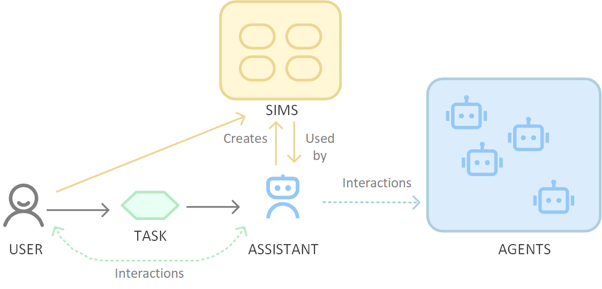

# Title
Agents Are Not Enough

# Authors
Chirag Shah(Professor, University of Washington), Ryen W. White(Microsoft)

# Publication Year
December 2024
# Journal
Published 19 December 2024 Computer Science

# Citation
NA

# 背景及び先行研究との違い
これまでのエージェント研究の課題は以下の５点である。

1. Lack of generalization. Many AI agents are designed for specific tasks and fail to generalize across different domains. This limitation arises from their reliance on predefined rules and lack of adaptive learning mechanisms.
2. Scalability issues. As the complexity of tasks increases, the computational resources required by AI agents grow exponentially. This scalability issue hampers their ability to handle real-world applications effectively.
3. Coordination and communication. In multi-agent systems, effective coordination and communication are critical. However, ensuring seamless interaction among agents remains a significant challenge, often leading to inefficiencies and conflicts. In addition, we also need enhanced mechanisms between a user and an agent to ensure that the questions and recommendations provided by the agent are both appropriate and effective for the task at hand.
4. Robustness. Many AI agents are brittle, meaning they perform well under specific conditions but fail when faced with unexpected situations. This brittleness stems from their lack of robust learning and adaptation capabilities.
5. Ethical concerns and safety. Ensuring that AI agents operate ethically and safely is a major concern. Failures in this area can lead to unintended consequences, such as biased decision-making or harmful actions. In addition, the trade-offs resulting from giving an agent more control to accomplish a task at the expense of user agency and learning opportunities are not well understood.

# 研究内容
Figure 1.Envisioning a new eco-system with Agents, Sims, and Assistants.

# 結果
NA(基本的に、論考であるため、実験はなし。)

# 考察
- 研究としては、結構しょぼい。Agents, Sims, and Assistantsの３つが今後のエージェントAIのために重要であると述べているもの