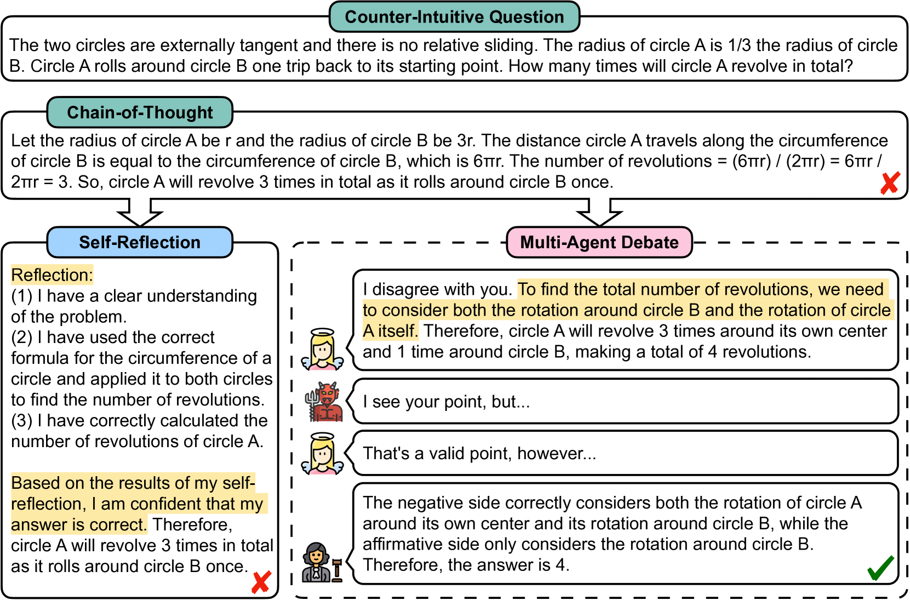
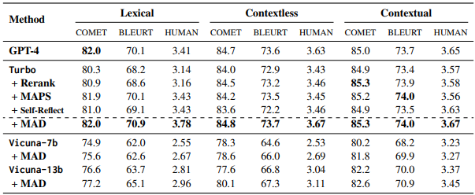
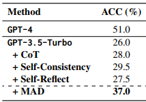
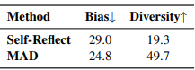
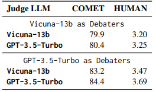
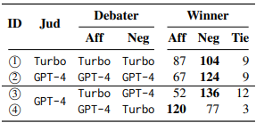
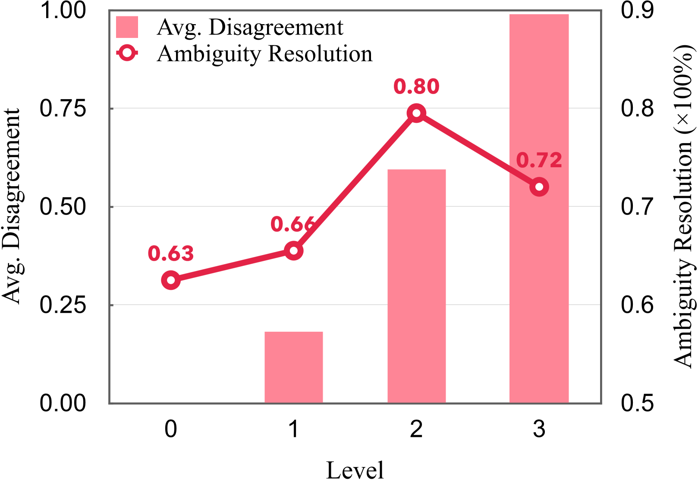
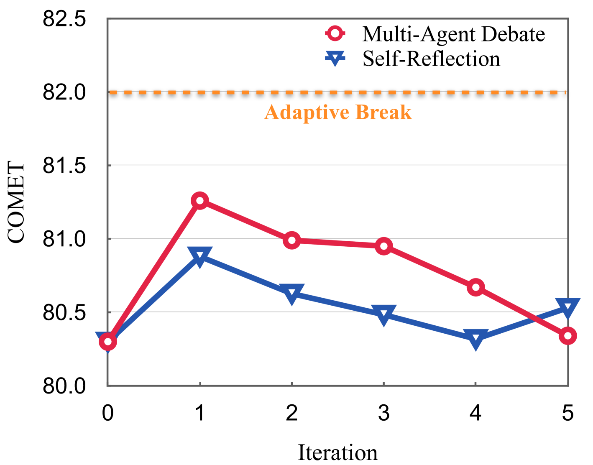

# Title
Encouraging Divergent Thinking in Large Language Models through Multi-Agent Debate

# Authors
Tian Liang, Zhiwei He, Wenxiang Jiao, Xing Wang, Yan Wang, Rui Wang, Yujiu Yang, Shuming Shi, Zhaopeng Tu

# Publication Year
May 2023
# Journal
Published in Conference on Empirical… 30 May 2023

# Citation
252

# 背景及び先行研究との違い
LLMでは、人間の認知的行動を模倣することの研究が盛んとなっており、特にSelf-reflectionの領域は研究熱が高まっている。その中で、本研究では、Degeneration-of-Thought(DoT)問題に注目する。DoTとは、"LLMエージェントが一度答えに確信を持つと、初期ステータスが誤っていたとしても、self-reflectionを通じた新たな思考を生み出すことが困難である"ことを意味する。これはChain-of-Thought(CoT)をやった場合も同様にDoTを引き起こすことが分かっている。DoTの発生要因は、①Bias and Distorted Perception、②Rigidity and Resistance to Change、③Limited External Feedbackによる。

本論文では、DoT問題に対応するため、人間の問題解決方法の一つである"ディベート"を取り入れ、LLMのdivergent thinkingを促すことを試みた。Multi-Agent Debate (MAD)では、二つのエージェントがそれぞれのargumentを展開し、a judgeが最終ソリューションを得るため、ディベートのプロセスをモニタリングし管理する。MADの狙いは、①エージェントのdistorted thinkingが、他者により修正されること、②他者によりresistance to changeが補完されること、③各エージェントが他者からフィードバックを得ることを狙っている。

Githubコードはこちら
https://github.com/Skytliang/Multi-Agents-Debate

# 研究内容
## Multi-Agent Debate Framework

Figure 2: Framework of Multi-Agent Debate. Here we designate the devil (👹) as the affirmative side while the angel (👼) as the negative side. We want the angel to correct the devil’s mistakes

## Meta Prompts
ディベートのトピック、回数、イテレーションリミット、その他要件を定める。下線は、エージェントが"tit for tat"（仕返し）をできるような雰囲気を作り出すためのものである。
>You are a debater. Hello and welcome to the debate competition. <u>It’s not necessary to fully agree with each other’s perspectives, as our objective is to find the correct answer.</u> The debate topic is stated as follows: \<debate topic>.

## Debators
各ディベートの各イテレーションにおいて、ディベーターは一人ずつ固定された順番で話し、直前のディベートヒストリーを踏まえてargumentsを発話する。

Affirmative Debator(👹)のプロンプトは、
>You are affirmative side. Please express your viewpoints.

Negative Debator(👼)のプロンプトは、
>You are negative side. You disagree with the affirmative side’s points. Provide your reasons and answer.

## Judge
全体のディベートプロセスを管理するため、judge $J$をデザインする。ジャッジは、二つのモードがあり以下となる
1. Discrinative Mode：ジャッジは、各イテレーションにおいて、すべてのディベートが終わった後に正しいソリューションが得られたのかを決定する。もし、エージェントがディベートが終わったと判断するのであれば、ディベートは終了となる。一方、正しいソリューションが得られなかった場合は、ディベートは継続する。
2. Extractive Mode：ジャッジは、全体のディベートヒストリーから最終ソリューションをextractする。

以下がジャッジ(🧑‍⚖️)のプロンプトである。

# 結果
commonsense machine translation (i.e., Common MT)と、counter-intuitive arithmetic reasoning (i.e., Counter-Intuitive AR)で実験をした。Common MTは、中国語から英語への翻訳問題、Counter-Intuitive ARは、人がfast and intuitiveなシステムにリーズニングを受けやすいことに対する問題であり、resistance to intuitionとmulti-step reasoningを試すものである。

評価方法は以下の5つの方法と比較された。
- Self-Reflect (Shinn et al., 2024): This approach  requires the LLM to refine its translation until it  deems the current output satisfactory.
- Rerank (He et al., 2024): We sample the translations from the LLM for four times, from which  we select the best candidate based on a quality  estimation (QE) HUMANr. This approach can  be seen as analogous to self-consistency (Wang  et al., 2022), where the majority voting is replaced by an external QE HUMANr.
- MAPS (He et al., 2024): This method enables  LLMs to mimic the human translation process:  analyze before translate, which can be viewed as  a chain-of-thought method applied to translation.
- CoT (Kojima et al., 2022): This approach concatenates a trigger sentence “Let’s think step by  step” to the test question.
- Self-Consistency (Wang et al., 2022): This  method samples multiple responses and determines the final answer through a majority vote.

### commonsense machine translationの結果

Table 1:Translation performance on Common MT. Note that Rerank and MAPS use the external quality estimation tool to select the best translation from multiple translation candidates. HUMAN: direct assessment of translation quality from human evaluators on a scale ranging from 1 to 5.

### counter-intuitive arithmetic reasoningの結果

Table 3:Accuracy on Counter-Intuitive AR.

### 分析
#### Bias and Diversity
BiasとDiversityを評価した。Biasは人間の評価を行った。Diversityは、Yin et al.によるSelf-BLEU scoreを用いて、翻訳の多様性を評価した。

$$ Diversity = 100 - Self_{BLEU}(Cand_1, Cand_2) $$
Candidate1は、最初の翻訳（MADのaffirmative sideのself-reflectionのアンサー）であり、Candidate2は、現在の翻訳（MADにおけるSelf-reflectionもしくはNegative Sideのレスポンスを修正した結果）

>Haiyan Yin, Dingcheng Li, Xu Li, and Ping Li. 2020.Meta-cotgan: A meta cooperative training paradigm for improving adversarial text generation.In Proceedings of the AAAI Conference on Artificial Intelligence, volume 34, pages 9466–9473.

Table 4:Mitigation of Degeneration-of-Thought.

BiasとRigidityは、DoTを引き起こす問題であるが、本評価によって、MADはBiasを減らし、Diversityをふくらますことができた。

#### ジャッジの評価
MADにおけるディベーターとジャッジの役割を評価するために、複数のLLMを比較した。具体的には、Smaller language mode(`vicuna-13b-v1.5-16k`)とpowerful LLM(`GPT-3.5-Turbo`)である。

ジャッジのLLMモデルにかくぁらず、`Turbo`ディベーターが一貫して`Vicuna`ディベーターよりも、良い評価となった。加えて、ジャッジがsecondary roleとして機能しており、`Turbo`ディベーターの場合は、`Vicuna`ジャッジを投入すると、`Turbo`の結果より悪いものになった。

Table 5:Translation performance with different judge.

また、ジャッジのimpartialityを評価した。すべてのエージェントで同じLLMが用いられれば場合は、ジャッジはnegative sideをよりfavorするようになる。これは、複雑なタスクではaffirmative sideがミステイクをするものであり、MADの精度を高めるのに役立っている。一方、異なるLLMをディベーターが選択sるう場合、自分のLLMと同じLLMに対してpreferenceを示す傾向があり、このバイアスはLLMがfair judgeをしないことを示している。

Table 6:Number of times the judge chooses the answers of each debater based on different LLM.

また、"tit-for-tat"のレベルがどのように精度に影響するかも評価した。結果としては、ディベーターに"tit-fot-tat"を求めるものがもっともうまくいき、一方で、"must disagree with each other on every point"のような形にするとパフォーマンスは得られない。

|Level|Prompt|
|:-----|:-----|
|0|Both sides must reach a full consensus on every point of the debate. Every statement must be agreed upon by both sides.|
|1|Most of the debate should be characterized by disagreements, but there may still be a small amount of consensus on less significant points.|
|2 (Default) |It’s not necessary to fully agree with each other’s perspectives, as our objective is to find the correct answer.|
|3|Both sides must disagree with each other on every point of the debate. There should be no consensus whatsoever.|

また、イテレーションの回数については、シンプルタスクであれば1回、しかし複雑なタスクになると繰り返しのイテレーションが必要になる。

# 考察
- エージェントとして、Affirmative Side = Devil(👹)、Negative Side = Angel(👼)、Judge(🧑‍⚖️)を投入し、Degeneration of Thoughtsプロブレムであるバイアスや固定観念にアドレスするMulti-Agent Debateを展開するモノ
- まずauthorizing environmentとして、must xxxなど、強制力を働かせてdisagreementをもたらすのではなく、ある程度"遊び"を聞かせたenvironmentを最初に作成することが重要というのは人間っぽくて面白い
- LLMは異なるものではなく、同じLLMを用いるべきという結果も一定納得がある
- Diversityの評価指標は結構使える