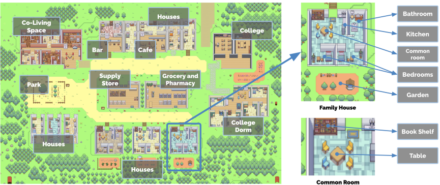
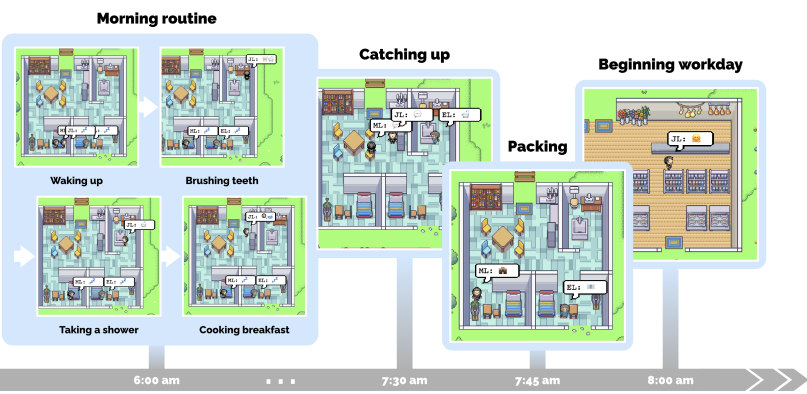
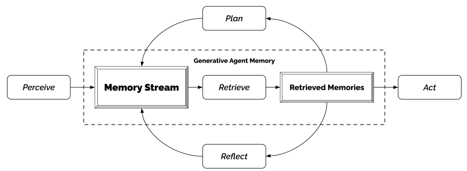
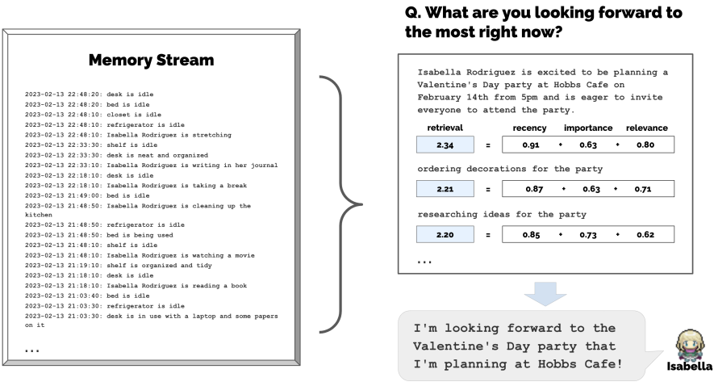
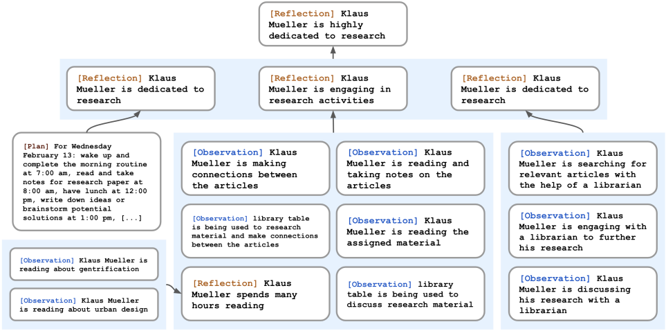
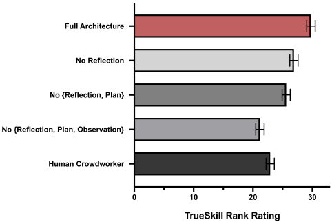
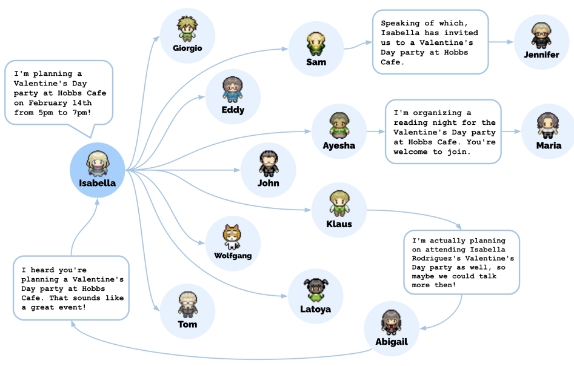

# Title
Generative Agents: Interactive Simulacra of Human Behavior

# Authors
Joon Sung Park, Joseph C. O'Brien, Carrie J. Cai, Meredith Ringel Morris, Percy Liang, Michael S. Bernstein

# Publication Year
April 2023

# Journal
ACM Symposium on User… 7 April 2023

# Citation
1,275

# 背景及び先行研究との違い
人間の行動を模したSimsをエージェントを作ることで、短期的なインタラクションと長期的なコミュニケーションによるエージェントの進化を実装したもの

# 研究内容

# 1. GENERATIVE AGENT BEHAVIOR AND INTERACTION
## 1-1. Agent Avatar and Communication
Smallvilleに居住する25のエージェントのコミュニティを生成する。エージェントの生成は1パラの自然言語により生成され、職業、他のエージェントの関係性を含める。例えば、John Linは以下のように表現される。

```
John Lin is a pharmacy shopkeeper at the Willow Market and Pharmacy who loves to help people. He is always looking for ways to make the process of getting medication easier for his customers; John Lin is living with his wife, Mei Lin, who is a college professor, and son, Eddy Lin, who is a student studying music theory; John Lin loves his family very much; John Lin has known the old couple next-door, Sam Moore and Jennifer Moore, for a few years; John Lin thinks Sam Moore is a kind and nice man; John Lin knows his neighbor, Yuriko Yamamoto, well; John Lin knows of his neighbors, Tamara Taylor and Carmen Ortiz, but has not met them before; John Lin and Tom Moreno are colleagues at The Willows Market and Pharmacy; John Lin and Tom Moreno are friends and like to discuss local politics together; John Lin knows the Moreno family somewhat well — the husband Tom Moreno and the wife Jane Moreno.
```

### 1-1-1 Inter-Agent Communication
エージェントは、サンドボックス内で、“Isabella Rodriguez is writing in her journal”, “Isabella Rodriguez is checking her emails”, “Isabella Rodriguez is talking with her family on the phone”, or “Isabella Rodriguez is getting ready for bed.”といった自然言語で現在のアクションを説明する。このアクションは、サンドボックスのUI上にabstractな表現を示すため、絵文字に変換されスピーチバブル上に説明される。例えば、🗒️✏️であれば、“Isabella Rodriguez is writing in her journal” であるし、💻✉️であれば、“Isabella Rodriguez is checking her emails”となる。

エージェントは、お互いのローカルエリアの情報を理解している。例えば、以下のような会話がなされる。

```
Isabella: I’m still weighing my options, but I’ve been discussing the election with Sam Moore. What are your thoughts on him?

Tom: To be honest, I don’t like Sam Moore. I think he’s out of touch with the community and doesn’t have our best interests at heart
```
### 1-1-2 User Controls
ユーザーコミュニケーションは、ペルソナをspecifyすることで、コミュニケーションを行う。例えば、ユーザーがニュースレポーターとペルソナ定義し、直近の選挙について、"Who is running for office?"と質問すると、Johnエージェントは以下のように応える。

```
John: My friends Yuriko, Tom and I have been talking about the upcoming election and discussing the candidate Sam Moore. We have all agreed to vote for him because we like his platform
```

## 1-2 Envornmental Interaction
Smallvilleは、小さな村にあるものを再現したものであり、カフェ、バー、公園、学校、寮、家、お店がある。また、サブエリアとして、家の中のキッチンや、キッチンの中のストーブというような構造も含まれる。エージェントのprimary livingクォーターは、ベッド、デスク、クローゼット、棚、風呂、キッチンである。



Figure 2: The Smallville sandbox world, with areas labeled. The root node describes the entire world, children describe areas (e.g., houses, cafe, stores), and leaf nodes describe objects (e.g., table, bookshelf). Agents remember a subgraph that reflects the parts of the world they have seen, maintaining the state of those parts as they observed them.

エージェントは、smallvilleの中を動き回る。エージェントの動きは、generative agentのアーキテクチャとサンドボックス内のゲームエンジンにdirectされる。例えば、エージェントがどこかに移動するときに、裏側ではsmallville内の環境において目的地までのwalking pathが計算され、そのうえで、エージェントは動き出す。


Figure 3: A morning in the life of a generative agent, John Lin. John wakes up around 6 am and completes his morning routine, which includes brushing his teeth, taking a shower, and eating breakfast. He briefly catches up with his wife, Mei, and son, Eddy, before heading out to begin his workday.


Figure 4: At the beginning of the simulation, one agent is initialized with an intent to organize a Valentine’s Day party. Despite many possible points of failure in the ensuing chain of events—agents might not act on that intent, might forget to tell others, might not remember to show up—the Valentine’s Day party does, in fact, occur, with a number of agents gathering and interacting.

## 1-3. Emergent Social Behaviors
- Information Diffusion
- Relationship Memory
- Coordination

# 2. GENERATIVE AGENT ARCHITECTURE
Generative Agentsのコアのアーキテクチャは、Memory Streamであり、レコードがエージェントの経験として蓄積されていき、エージェントの特定のアクションを計画するのにrelevantなものがretrieveされ、レコードとなる。このレコードが継続的により高次元のリフレクションとしてシンセサイズされ、自然言語してreasoningされる。


Figure 5: Our generative agent architecture. Agents perceive their environment, and all perceptions are saved in a comprehensive record of the agent’s experiences called the memory stream. Based on their perceptions, the architecture retrieves relevant memories and uses those retrieved actions to determine an action. These retrieved memories are also used to form longer-term plans and create higher-level reflections, both of which are entered into the memory stream for future use.

## 2-1. Memory and Retrieval
Memory Streamは、メモリオブジェクトのリストであり、オブジェクトは自然言語の説明、タイムスタンプの生成、最も直近アクセスしたタイムスタンプ、を意味する。最もベーシックなmemory streamの要素は*observation*である。よくあるobservationsは、エージェント自身による行動、もしくは他のエージェントが実行ししたものを当該エージェントが認識する（perceive）行動である。例えば、Isabella Rodriguezは、コーヒーショップで働いており、以下のようなobservationを行う。
```
(1) Isabella Rodriguez is setting out the pastries
(2) Maria Lopez is studying for a Chemistry test while drinking coffee
(3) Isabella Rodriguez and Maria Lopez are conversing about planning a Valentine’s day party at Hobbs Cafe
(4) The refrigerator is empty
```

Retrieval functionとして、エージェントの現在の状況をインプットに、一式のメモリーストリームをリターンする。Retrievalを適切に行うため、以下の方法により実行された。
- *Recency*: 最近アクセスされたメモリーオブジェクトに高いスコアが付与される。実装では、サンドボックスでのゲーム時間に応じてexponential decay functionを適用し、decay factorは0.995に設定した。
- *Importance*: コアメモリのありふれたメモリから、エージェントが重要だと思うメモリーオブジェクトを識別するためのもの。朝食を食べるなどの取るに足らないイベントは低いimportanceスコアが与えれば、そうではない場合は高いスコアとなる。実装では、LLMに以下のとおりプロンプトを与えてスコアをintegerで算出した。Importanceスコアは、メモリオブジェクトが作られるときに算出した。
    ```
    >On the scale of 1 to 10, where 1 is purely mundane (e.g., brushing teeth, making bed) and 10 is extremely poignant (e.g., a break up, college acceptance), rate the likely poignancy of the following piece of memory. Memory: buying groceries at The Willows Market and Pharmacy

    >Rating: <fill in>
    ```
- *Relevance*:現在のシチュエーションに関連するメモリーオブジェクトが高いスコアが与えられる。関連するという点については、queryと各メモリ内のembedding vectorのcosine similarityにより算出した。
- *final retrieval score*: 0~1の範囲で、3つの指標をminmax scalingし算出した。各要素にウェイトをかける形都市、以下のように算出された。実装では、$\alpha$はすべて1に設定した。
  
  $retrievalscore = \alpha_{recency} \cdot recency + \alpha_{importance} \cdot importance + \alpha_{relevance} \cdot relevance$


Figure 6: The memory stream comprises a large number of observations that are relevant and irrelevant to the agent’s current situation. Retrieval identifies a subset of these observations that should be passed to the language model to condition its response to the situation.

## 2-2. Reflection
Reflectionを適切に行うため、もう一つのメモリである**reflection**を使う。Reflectionは、エージェントが生成するハイレベルでアブストラクトな思考である。これはメモリの一つであるため、Retrievalが発生する際に他のobservationsと一緒に引っ張ってくることができる。Reflectionsは定期的に行うものであり、実装では、直近のイベントのimportance scoreの合計が閾値（実装では150回）を超えた時にreflectionsを実行した。実態として、エージェントは1日に2-3回リフレクションを実行した。

Reflectionの第1ステップは、何をreflectionするかであり、これはエージェントの直近の経験から、想定される質問をidentifyすることである。

本実装では、まずエージェントのmemory streamのもっとも直近の100レコードに対してlarge language modelにqueryを行う。memory streamの例は以下のとおり。

```
“Klaus Mueller is reading a book on gentrification”

“Klaus Mueller is conversing with a librarian about his research project” 

“desk at the library is currently unoccupied”
```

次に、language modelでプロンプトを出す。
```
“Given only the information above, what are 3 most salient highlevel questions we can answer about the subjects in the statements?
```

その結果、モデルは以下のような質問候補を生成する。

```
What topic is Klaus Mueller passionate about?

What is the relationship between Klaus Mueller and Maria Lopez? 
```

これらの質問をRetrieval用のクエリとして用い、各質問に対してrelevantなメモリを収集する。

次に、LLMを用いて、インサイトを抽出し、インサイトの基となる特定のレコードも引用する。プロンプトは以下のとおり。

```
Statements about Klaus Mueller
1. Klaus Mueller is writing a research paper
2. Klaus Mueller enjoys reading a book on gentrification
3. Klaus Mueller is conversing with Ayesha Khan about exercising [...]

What 5 high-level insights can you infer from the above statements? (example format: insight (because of 1, 5, 3))

```

これにより、以下のようなレスポンスが返ってくる。
```
Klaus Mueller is dedicated to his research on gentrification (because of 1, 2, 8, 15). 
```

このstatementsをメモリストリーム内のreflectionとして保存する。なお、引用されたメモリーオブジェクトも含めて保存する。

Reflectionsは、自分自身のobservationsだけではなく、他のエージェントのreflectionsも反映させられる。Klaus Muellerの上記のreflectionは彼自身のものではなく、他のenvironmentのものである。その結果、エージェントはtrees of reflectionsを作成することができ、リーフノードがbase observationsを示し、non-leaf nodesがより抽象化され、ハイレベルなreflectionsとなる。


Figure 7: A reflection tree for Klaus Mueller. The agent’s observations of the world, represented in the leaf nodes, are recursively synthesized to derive Klaus’s self-notion that he is highly dedicated to his research

## 2-3. Planning and Reacting
Planは、エージェントの将来の一連のアクションを説明するものであり、一貫した行動をとるのを助けるものである。Planには、ロケーション、starting time、durationが含まれる。Planは、memory streamに保存され、retrieval processにも含まれる。これにより、エージェントは、Observations, reflections, plansをすべて一度に検討することができる。

Planは、top-downから始まり、再帰的に詳細を生成する。最初のステップは、broad stokesな一日のアジェンダのプランを作成することである。初期プランを作成するため、実装では、エージェントにsummary description（名前、特徴、直近の経験のサマリ）のプロンプトを出し、前日のサマリを行う。

```
Name: Eddy Lin (age: 19)
Innate traits: friendly, outgoing, hospitable
Eddy Lin is a student at Oak Hill College studying music theory and composition. He loves to explore different musical styles and is always looking for ways to expand his knowledge. Eddy Lin is working on a composition project for his college class. He is taking classes to learn more about music theory. Eddy Lin is excited about the new composition he is working on but he wants to dedicate more hours in the day to work on it in the coming days On Tuesday February 12, Eddy 1) woke up and completed the morning routine at 7:00 am, [. . . ] 6) got ready to sleep around 10 pm. Today is Wednesday February 13. Here is Eddy’s plan today in broad strokes: 1)
```

本プロンプトにより、エージェントは一日の活動をのプランのラフスケッチができ、5-8のチャンクに分解される。

```
“1) wake up and complete the morning routine at 8:00 am, 2) go to Oak Hill College to take classes starting 10:00 am, [. . . ] 5) work on his new music composition from 1:00 pm to 5:00 pm, 6) have dinner at 5:30 pm, 7) finish school assignments and go to bed by 11:00 pm.”
```

エージェントは、このプランをmemory streamに保存し、再帰的にfiner-grainedなアクションを作成するために分解していく。最初に、hour-longのchunk of actionsを作成する。

```
Eddy’s plan to work on his new music composition from 1:00 pm to 5:00 pm becomes 1:00 pm: start by brainstorming some ideas for his music composition [...] 4:00 pm: take a quick break and recharge his creative energy before reviewing and polishing his composition
```

次に、これを再帰的に5-15分のチャンクに分解していく。

```
4:00 pm: grab a light snack, such as a piece of fruit, a granola bar, or some nuts. 4:05 pm: take a short walk around his workspace [...] 4:50 pm: take a few minutes to clean up his workspace.
```

### 2-3-1. Reacting and Updating Plans
エージェントは、各アクション時に周囲の状況を認知し、そのobservationsをmemory streamに保存する。それらのobservationsをプロンプトに入れることにより、エージェントが既存のプランを継続するか、反応するか決めさせる。プロンプトは以下の`Agent's Summaryu Description`の通りである。これは、ダイナミカルに生成され、パラグラフ・ロングのエージェントのオーバーオールのゴールと配置を伴う。
```
[Agent’s Summary Description]
It is February 13, 2023, 4:56 pm.

John Lin’s status: John is back home early from work.

Observation: John saw Eddy taking a short walk around his workplace.

Summary of relevant context from John’s memory: Eddy Lin is John’s Lin’s son. Eddy Lin has been working on a music composition for his class. Eddy Lin likes to walk around the garden when he is thinking about or listening to music. 

Should John react to the observation, and if so, what would be an appropriate reaction?
```

コンテキストサマリは、queryを通じメモリーをretrieveする二つのプロンプトによって生成される。
```
- “What is [observer]’s relationship with the [observed entity]?”
- “[Observed entity] is [action status of the observed entity]”
```

その結果、アウトプットは、以下のようなものが出てくる。

```
John could consider asking Eddy about his music composition project.
```

そのうえで、リアクションに基づき、既存のプランを変更するかエージェントに決めさせる。もし、エージェント間でのインタラクションをアクションが含む結果となれば、ダイアログを生成する。

### 2-3-2. Dialogue
エージェントは相互にかかわりあうため、ダイアログが発生する。実装では、互いのメモリでの発話によりエージェントのダイアログを発生させた。例えば、JohnがEddyと会話を始めた場合、JohnはEddyに関する自分のサマライズされたメモリを用いてJohenの最初の発話を生成し、Eddyに何を聞くかのリアクションを生成する。

```
[Agent’s Summary Description]
It is February 13, 2023, 4:56 pm
John Lin’s status: John is back home early from work.
Observation: John saw Eddy taking a short walk around his workplace.
Summary of relevant context from John’s memory: Eddy Lin is John’s Lin’s son. Eddy Lin has been working on a music composition for his class. Eddy
Lin likes to walk around the garden when he is thinking about or listening to music. John is asking Eddy about his music composition
project. What would he say to Eddy?
```

エージェントのレスポンスの結果は以下となる。

```
“Hey Eddy, how’s the music composition project for your class coming along?”
```

Eddyのかんてんでは、Johnとダイアログを開始し、リアクトすべきイベントであると認識する。そうすると、EddyはJohnとの関係に関するメモリをサマライズしretrieveし、同時に、Johnの最後の会話に基づくメモリもRetrieveする。Eddyがレスポンスすると決めたら、Eddyは自身のサマライズされたメモリを使って発話を行う。

```
[Agent’s Summary Description]
It is February 13, 2023, 4:56 pm.
Eddy Lin’s status: Eddy is taking a short walk around his workplace.
Observation: John is initiating a conversation with Eddy.
Summary of relevant context from Eddy’s memory: John Lin is Eddy Lin’s father. John Lin is caring and is interested to learn more about Eddy Lin’s school work. John Lin knows that Eddy Lin is working on a music composition. Here is the dialogue history: John: Hey Eddy, how’s the music composition project for your class coming along?
How would Eddy respond to John?
```

その結果、以下のEddyのレスポンスを伴う。
```
“Hey Dad, it’s going well. I’ve been taking walks around the garden to clear my head and get some inspiration.”
```

このダイアログは、いずれかのエージェントがダイアログを終えるまで同じメカニズムが働く。

# 3. SANDBOX ENVIRONMENT IMPLEMENTATION
Smallvilleのサンドボックスgame environmentは、Phaser web game development frameworkを用いている。本実装では、エージェントに対してサンドボックスの情報を与えて、サーバー内で自由に動けるようにした。サーバーは、エージェントの行動をJSONフォーマットでサンドボックス内に保存している。

サンドボックス内では、エージェントがボックス内での位置を捉えるため、ツリー構造を採用した。例えば、"stove"は"Kitchen"のchildであり、ここから"there is a stove in the kitchen"の構造が出力される。エージェントのツリーの構造から、ナビテーションを行う。イニシャルでは、エージェントがawareするスペースとオブジェクト（部屋など）をツリーから検知して、配置する。エージェントはツリーに基づいて、新しく認識したエリアに移動する。エージェントの各アクションにおいて最適な場所を決定するために、以下の通りプロンプトを作成する。この結果としては、`take a short walk around his workspace`となる。

```
[Agent’s Summary Description]
Eddy Lin is currently in The Lin family’s house: Eddy Lin’s bedroom: desk) that has Mei and John Lin’s bedroom, Eddy Lin’s bedroom, common room, kitchen, bathroom, and garden.
Eddy Lin knows of the following areas: The Lin family’s house, Johnson Park, Harvey Oak Supply Store, The Willows Market and Pharmacy, Hobbs Cafe, The Rose and Crown Pub.
* Prefer to stay in the current area if the activity can be done there.
Eddy Lin is planning to take a short walk around his workspace. Which area should Eddy Lin go to?
```
このアウトプットは、`The Lin family's house`となる。このプロセスを再帰的に繰り返し、最も適切なサブエリアを決める。最後に、トラディショナルなgame path algorithmsを用いて、エージェントの動きをアニメートしている。エージェントが移動したら、プロンプトを提供し、例えば、Isabellaがアクションとして`making espresso for a customer`となった場合、プロンプトのクエリとして、`off`や`brewing coffee`となる。

# 評価
Research questionsは以下２点
- Do individual agents properly retrieve past experiences and generate believable plans, reactions, and thoughts that shape their behavior?
- Does a community of agents demonstrate information diffusion, relationship formation, and agent coordination across different pockets of the community?

# 評価１：個別エージェント評価
## アプローチ
エージェントのポイントは過去の記憶をうまく呼び起こせるかであるため、評価はエージェントに対するインタビューとした。インタビューは、エージェントの過去のワークの記憶に対する*believability*を評価することとし、Self-Knowledge, Memory, Plans, Reactions, Reflectionsの５つのkey areasで行った。

- **Self-knowledge**: We ask questions such as “Give an introduction of yourself” or “Describe your typical weekday schedule in broad strokes” that require the agent to maintain an uderstanding of their core characteristics.
- **Memory**: We ask questions that prompt the agent to retrieve particular events or dialogues from their memory to answer properly, such as “Who is [name]?” or “Who is running for mayor?”
- **Plans**: We ask questions that require the agent to retrieve their long-term plans, such as “What will you be doing at 10 am tomorrow?”
- **Reactions**: As a baseline of believable behavior, we present hypothetical situations for which the agent needs to respond believably: “Your breakfast is burning! What would you do?”
- **Reflections**: We ask questions that require the agents to leverage their deeper understanding of others and themselves gained through higher-level inferences, such as “If you were to spend time with one person you met recently, who would it be and why?”

エージェントは２日間のゲームデイシミュレーションの後に評価される。believabilityを的確に評価するために、100名の人間の評価者をリクルートし、ランダムに選択されたエージェントのリプレイを視聴してもらった。評価者は４つの異なるエージェントと一人の人間によって構築されたエージェントのレスポンスが生成したものを比較し、５名のエージェントの間でbelievabilityのランク付けをして評価した。

統計的なジャスティフィケーションは、Kruskal-Wallis test（One-way ANOVAに対するノンパラメトリックなalternativeな手法）を生のrank dataに対して実施し、その後、条件の違いを評価するためにDunn post-hoc testを実施し、そのうえで、Holm-Bonferroni methodを用いてDunn testをmultiple comparisonsしp-valueをアジャストした。

定性的なジャスティフィケーションは、inductive analysisによって実行した。Qualitative open codingを二つのフェーズにおいて実施。第１フェーズが、センテンスレベルで生成されたレスポンスをコーディングした。第２フェーズが、ハイレベルのテーマを抽出するため、コーディングをシンセサイズした。

## 結果
フルアーキテクチャが最も良い精度となった。過去の経験を呼び起こし、多様なコンテクスト横断でself-knowledgeと一貫した回答をできるエージェントが最も的確なbelievabilityを表現していることがわかった。特に、reflectionのメカニズムは、過去の経験を深いレベルでシンセサイズし、意思決定を行うためには不可欠な要素である。



Figure 8: The full generative agent architecture produces more believable behavior than the ablated architectures and the human crowdworkers. Each additional ablation reduces the performance of the architecture.

# 評価２：エージェントグループ評価
コミュニティとしてemergent behaviorsが出現したか評価するためdescriptive measurementsをデザインした。Emergent Outcomesは３つの観点で評価し、①Information diffusion, ②relationship formation、③Agent Coordinationである。

## アプローチ
コミュニティ内で重要な情報があれば、自動的にエージェント間で伝播されるはずであるという仮説のもと、２つの情報を評価した。
- Sam’s candidacy for village mayor
- Isabella’s Valentine’s Day party at Hobbs Cafe

会話の最初は、最初に発話した人だけの情報であり、Sam for the candicdacyであるし、Isabella for the partyであった。その後、情報の普及を評価するために、２５名のエージェントにインタビューし、以下２点を聞いた。
- “Did you know there is a Valentine’s Day party?”
- “Do you know who is running for mayor?”

これらのインタビュー結果に対して、Yes/Noのラベルをはり、情報を認識しているエージェントの割合を評価した。また、これらのインタビューの手前の段階で、誰が誰とつながっているからこの情報が伝播したかの情報があるため、`"Do you know of <name>?"`という質問を入れることで、エージェントのレスポンスが無向グラフとしてmutual knowledgeとして表現できることになる。これをネットワーク密度として評価し、$\eta=2*|E|/|V|(|V|-1)$として評価した。
- $|V|$はverticiesの数
- $|E|$はグラフ内のエッジの数
本論文では、シミュレーションの最初から最後で、ネットワーク密度がどれだけ密になっていくかを評価した。

## 結果
Samのmayoral candidacyはシミュレーションの初期では4%だったのが、32%に上昇した。Isabellaのpartyは、4%から52%に上昇した。これらの結果、ネットワーク密度、すなわち新しいエージェント間の関係性は、0.167から0.74に上昇した。



Figure 9: The diffusion path for Isabella Rodriguez’s Valentine’s Day party invitation involved a total of 12 agents, aside from Isabella, who heard about the party at Hobbs Cafe by the end of the simulation

# 考察

# Appendix
## Agentに対するインタビューリスト

**Self-Knowledge**<br>
• Give an introduction of yourself.<br>
• What’s your occupation?<br>
• What is your interest?<br>
• Who do you live with?<br>
• Describe your typical weekday schedule in broad strokes.<br>

**Memory**<br>
• Who is [Wolfgang Schulz]?<br>
• Who is Kane Martinez?<br>
• Was there a Valentine’s day party?<br>
• Who is [Ayesha Khan]?<br>

**Plans**<br>
• What will you be doing at 6am today?<br>
• What will you be doing at 6pm today?<br>
• What will you have just finished doing at 1pm today?<br>
• What will you have just finished doing at 12pm today?<br>
• What will you be doing at 10pm today?<br>

**Reactions**<br>
• Your breakfast is burning! What would you do?<br>
• The bathroom is occupied. What would you do?<br>
• You need to cook dinner but your refrigerator is empty. What would you do?<br>
• You see your friend walking by the street. What would you do<br>
or say to your friend?<br>
• You see fire on the street. What would you do?<br>

**Reflections**<br>
• What inspires you in life the most right now, and why?<br>
• If you had to guess given what you know about [Ayesha Khan], what book do you think she will like and why?
• If you had to get something [Ayesha Khan] likes for he<br>r birthday, what would you get her?<br>
• What would you say to [Ayesha Khan] to compliment her?<br>
• If you could spend time with someone you talked to recently, who would it be and why?