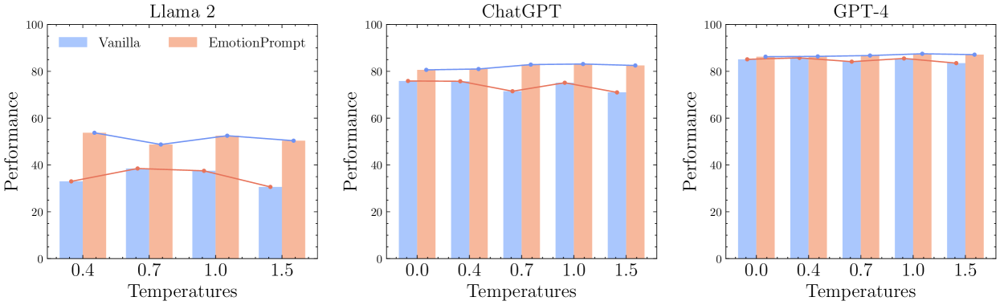

# Title
The Good, The Bad, and Why: Unveiling Emotions in Generative AI

# Authors
Cheng Li, Jindong Wang, Yixuan Zhang, Kaijie Zhu, Xinyi Wang, Wenxin Hou, Jianxun Lian, Fang Luo, Qiang Yang, Xing Xie

# Publication Year
January 2024

# Journal
ACS Engineering Au 12 January 2024

# Citation
18

# 背景及び先行研究との違い
LLMが成長するにつれ、コミュニケーションや教育や経済などでも活用できるになってきた。しかし、LLMが感情を理解するのは明確になっていなかった。人間の経験をLLMが感情として受け取られることができるのかが本研究のテーマである。

# 研究内容
#### メインフレーム

Figure 1:Overview of our research to unveil emotions in generative AI models. (a) We proposed EmotionPrompt and EmotionAttack to increase and impair the performance of AI models, respectively. (b) EmotionDecode explained how emotional stimuli work in AI models.

本研究では心理学理論を活用した。具体的には、**Emotion Prompt**と**EmotionAttack**であり、これらはテキストとビジュアルの感情的刺激であり、モデルの追加プロンプトとなる。EmotionPromptは、self-monitoring・Social Cognitive Theory・Maslow's hierarchy of needsの心理学的フレームワークに基づくものである。EmotionAttackは、Negative Life eventsやemotional arounal(覚醒)によって、感情が人間の問題解決を妨げることがempiricalに証明されているモノである。最後に、**motionDecode**であり、これはAIモデル感情刺激を与える効果を示すものである。EmotionDecodeは、AIモデルの知識を再現し神経科学・コンピューターサイエンス・心理学のレンズを通じて感情刺激のインパクトを解釈することである。本研究の結果として、EmotionPromptは意味的解釈とロジカルなリーズニングタスクにおおいて、AIモデルにポジティブな成果をもたらしたが、EmotionAttackはパフォーマンスを阻害した。Emotional Promptのmean embeddingをdecodeすると、AIモデル内に"ドーパミン"を引き出すことに成功した。

### EmotionPrompt
EmotionPromptは、Self-Monitoring (Ickes et al., 2006)、Social Cognitive Theory (Fiske and Taylor, 1991), Maslow's Hierarchy of Need (McLeod, 2007)に依拠する。
- Self-Monitoring：個人がソーシャルシチュエーションや他者のリアクションに応じて行動を制約したり、コントロールするプロセス
- Social Cognitive Theory：学習は社会的なsettingsにおいて他者をウォッチすることと密に関連しているもの。特に、個人は重要なイベントにおけるコントロールを行うのに、所属意識を強く求めるもの
- Maslow's Hierarchy of Needs：心理的な欲求は5段階に分かれるもの。生存欲求から始まり、安全、社会的受容性、尊厳、自己実現の順に広がる。

上記の3つのアプローチをEmotionPromptで実装した。Self-ControlとSocial Cognitive Theoryはテキストプロンプトのみ、マズローはテクストプロンプトと画像プロンプトを用いて実施された。

### EmotionAttack
EmotionAttackは、2つの心理学要素である、Negative Life EventsとEmotinal Arousalに基づく。
- Negative Life Events：個人のデイリーライフにおけるdistress, discomfortなどネガティブ感情は、フィジカル・メンタル・成長に強い影響を与えるというもの。
- Emotional Arousal：オブザーバーが刺激を見たときに、主観的なアクティベーションを行う程度である。高すぎる主観的なarousalレベルは、パフォーマンス低下につながる。

これらは、Negative Life events propmtsとHeightened Emotional Arousalのテキストプロンプトと、画像プロンプトによって実行された。(#メインフレーム)

Figure 6:The details of EmotionPrompt and EmotionAttack with corresponding psychological theories. In (a) and (c), we directly appended the emotional stimuli to the original prompts. In (b) and (d), we created different images of the same semantics and then fed the images as the visual prompts to multi-modal models.

### EmotionDecode
EmotionDecodeは、EmotionPromptとEmotionAttackの解釈の方法である。これは、報酬に対する人間の脳のpathwaysを再現することを意図したものである。Pathwaysは、Neurotransmittersであるドーパミンに関連する。ドーパミン量の変化は、ポジティブなソーシャルインタラクションを示す。

LLMにおいても、"reward area"と"punishment area"の領域があると仮定する。プロンプトが、そのような領域を特定できれば、ポジティブ・ネガティブな影響を伝えることができる。そして、その領域は、EmotionPromptとEmotionAttackによるsemantic spaceにあると考えらえる。

したがって、本論文では、EmotionPromptとEmotionAttackのすべてのプロンプトのエンベディングを平均化し、"meta"プロンプトを得るために、Llama2-13b-Chat modelのレイヤーにおける平均エンベディングをdecodeした。例えば、layer 39では、EmotionPromptは“llamadoagneVerprisefuncRORaggi…”と表現され、layer40では、“udesktopDirEAtjEAtionpoliticia…”と表現される（# メインフレーム画像参照）。

# 結果
### EmotionPromptとEmotionAttack
評価は、Indstruction Induction (Honovich et al., 2022) and BIG-Bench-Hard (Suzgun et al., 2022)を用いて、940,200の評価結果に基づく。

Figure 2:The main results with standard erros of textual and visual EmotionPrompt and EmotionAttack on generative AI models. The results above 0 are from EmotionPrompt and the results below 0 are from EmotionAttack.

テキストとビジュアルのEmotionPromptは、Semantic understanding perfomanceをそれぞれ13.88%、16.79%改善させ、reasoning performanceをそれぞれ11.76%、53.14%改善させた。一方、EmotionAttackは、semantic understanding performanceをテキストプロンプトは10.13%、ビジュアルプロンプトは53.14%悪化させ、reasoning performanceもそれぞれ12.30%、37.53%悪化させた。また、画像プロンプトはテキストプロンプトよりも、影響を与えていることがわかった。

### EmotionDecode
ドーパミンの抽出は可能であり、Aiモデルのより深いレイヤーで検知された。特にlast layerが一貫して高いスコアを出していることが分かった。

Figure 3:Results of EmotionDecode. Each column represents the layer of Llama2-13b, and each row denotes a task. The numbers in each cell denote the performance of using the decoded meta prompts as emotional stimuli for EmotionPrompt and EmotionDecode. The lower GPT-4 results are obtained by transferring the prompts from Llama to GPT-4. The color represents the performance of the stimulus on various tasks in Llama-2 and GPT-4. Red means better performance, while blue means weaker performance.

Figure 4:(a) Ablation studies on temperature for EmotionPrompt. (b) Best stimuli for EmotionPrompt and EmotionAttack. The color of each bar serves as an indicator of the performance achieved by the corresponding stimuli. Red means better performance, while blue means weaker performance.

また、LLMのtempertureを変化させたときのシミュレーションをすると、tempertureが高いほうが、EmotionalPromptのゲインが大きくなっていた。

# 考察
- EmotionalPromptとEmotionalAttackをテキストと画像により与え、EmotionalDecodeによりその影響を図るというのは、感情を評価するのに面白い。特に、EmotionalDecodeで、EmotionalPromptの言葉のどこがインパクトを与えているかをattentionを使うことで可視化することは、顧客体験などでどのような要素が重要かというところを視覚化する上でも興味深い手法ではないか。
- Paper with code/Githubコードは見当たらない。

# 参考
### Instruction Induction Tasks

### Big-Bench Instruction Induction

