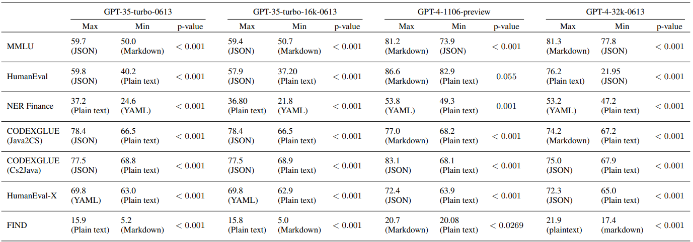
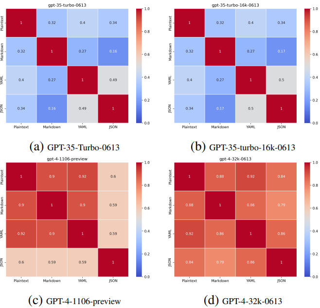
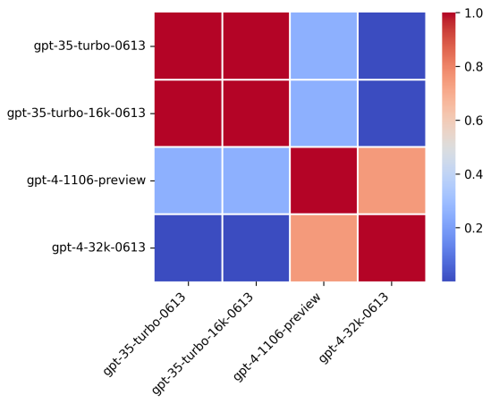

# Title
Does Prompt Formatting Have Any Impact on LLM Performance?

# Authors
Jia He, Mukund Rungta, David Koleczek, Arshdeep Sekhon, Franklin X Wang, Sadid Hasan

# Publication Year
2024

# Journal
15 November 2024 Computer Science

# Citation
NA

# 背景及び先行研究との違い
これまでプロンプトのリフレーズや内容による精度影響は評価されてきていたが、プロンプトテンプレートのフォーマットがどのように精度に影響を及ぼしているかは十分に研究されなかった。

本研究では、plain text, Markdown, JSON, and YAMLの形式がどのように制度に影響を与えるのか評価した。

# 研究内容
## Promptフォーマット
- plain text, Markdown, JSON, and YAML

## Prompt内容
評価をするためのプロンプトは、

- persona, task instructions, examples, output format instructions, and user ask

で与えられた。

## 比較モデル
OpenAI’s GPT-3.5 and GPT-4 models via Azure Microsoft (2024).
- For GPT-3.5, we used “gpt-35-turbo-0613” and “gpt-35-turbo-16k-0613” to compare context window sizes (4k vs. 16k).
- For GPT-4, we used “gpt-4-32k-0613” and “gpt-4-1106-preview” to test the newer, faster variant with a 128k context window.

## 評価指標
- Sensitivity:To what extent does the performance of GPT models vary with different prompt formats?
- Consistency: Are GPT models capable of producing uniform responses to identical queries when presented with varying prompt structures?
- Transferability: Is there an optimal prompt format that is universally effective across diverse GPT models, thereby ensuring peak performance?

## 対象データ
- Natural Language to Natural Language (NL2NL): Includes Massive Multitask Language Understanding (MMLU) Hendrycks et al. (2020) and NER Finance from OpenAI Evals OpenAI (2023).
- Natural Language to Code (NL2Code): Includes HumanEval Chen et al. (2021) and FIND Schwettmann et al. (2023).
- Code to Code (Code2Code): Includes CODEXGLUE Lu et al. (2021) and HumanEval-X Zheng et al. (2023).

# 結果
## Sensitivity

Table 1:Sensitivity of model performance to prompt format assessed using one-sided matched pair t-tests. Table displays metrics for top and bottom formats (Max/Min) and p-values for each dataset/model. All p-values are below 0.05, except for GPT-4-1104-preview on HumanEval, confirming widespread prompt format sensitivity.

**結論**：プロンプトテンプレートはSensitivityに影響を与える。
- GPT-35-turbo-0613 and GPT-35-turbo-16k-0613では、MarkdownからPlain Textに変更すると200%の改善（FINDデータセットの場合）
- GPT-4 modelの32k-0613では、JSONからPlain Textに変更すると300%の改善

## Consistency
Consistencyは以下のConsistency Metric (Shu et al.([2023](https://arxiv.org/abs/2311.09718)))により評価。二つのプロンプトテンプレート（$P_\alpha$, $P_\beta$）が、同一のレスポンスを返すかを評価するものである。Nはテストセットサイズ、Aはモデルの回答であり、高いスコアがプロンプト間でのConsistencyを保つものである。

$C(P_\alpha, P_\beta)=\frac{1}{N}\sum_{i=1}^N\gamma(A_{P_\alpha}(X_i)=A_{P_\beta}(x_i))$

Figure 2:Consistency comparison for MMLU dataset: GPT-3.5 models show consistency scores below 0.5 across format pairs, whereas GPT-4 consistently exceeds 0.5, indicating greater reliability.

**結論**：モデルのレスポンスの一貫性は、サイズの影響を受け、GPT-4が一貫して異なるプロンプト間での一貫した結果を出した。
- GPT3.5-turboは、スコアが0.5であり、低い一貫性となった。MarkdownとJSONでは、16%しか同一の一貫性が保たれなかった。
- GPT4は、一貫性スコアが0.5を超え、異なるプロンプト間での一貫性が保たれた

## Transferability
Transferabilityは、以下の　IoUにより評価した。

Figure 3:Intersection over Union (IoU) scores for top templates on the NER Finance benchmark across models. Higher IoU is observed within same-version model pairs, whereas cross-version pairs exhibit lower IoU.

**結論**：Optimal Performanceを出すには、モデルスペシフィックなプロンプトエンジニアリングが必要であり、Universallyにワークするフォーマットはないことが分かった。個別モデル毎にテーラーメードのプロンプトエンジニアリングが必要であり、異なるGPTモデルのTransferabilityはないことが分かった。
- GPT3.5は、JSONを好み、GPT-4はMarkdownを好む
- IoUベースの評価では、異なるモデルシリーズ（GPT3.5とGPT4など）では、低いCompatibilityを示し、スコアは0.2であった。
- 一方で、同じサブシリーズのモデル（GPT-35-turbo-16k-0613 and GPT-35-turbo-0613）は、高いIoUを示し、スコアは0.7であった。

# 考察
- 結論として、プロンプトフォーマットは様々なものを試すしかない。モデルサイズがプロンプトのバリエーションに影響を与えるため、より大きいモデルのほうが一貫性が得られる。