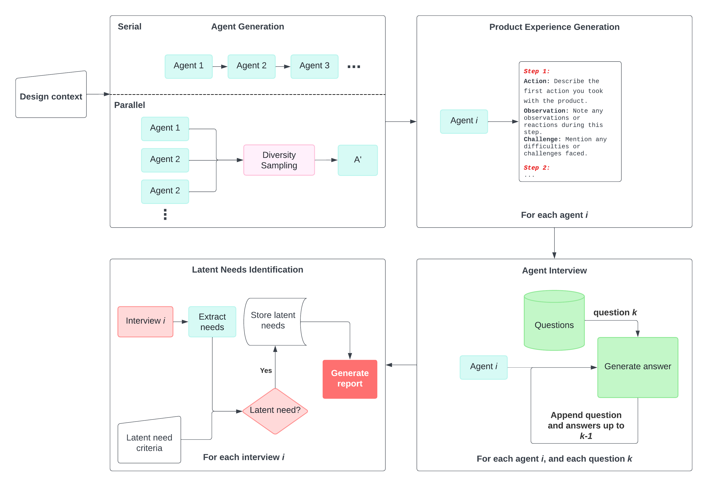
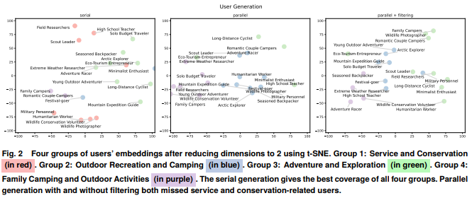
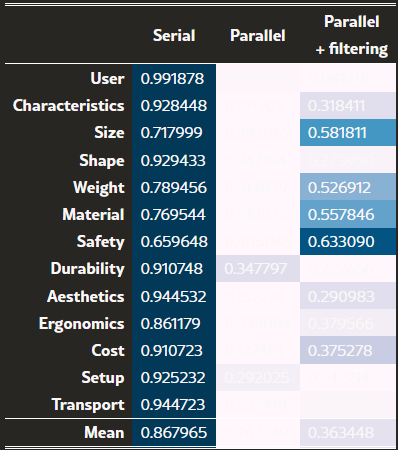
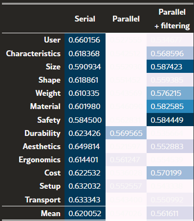
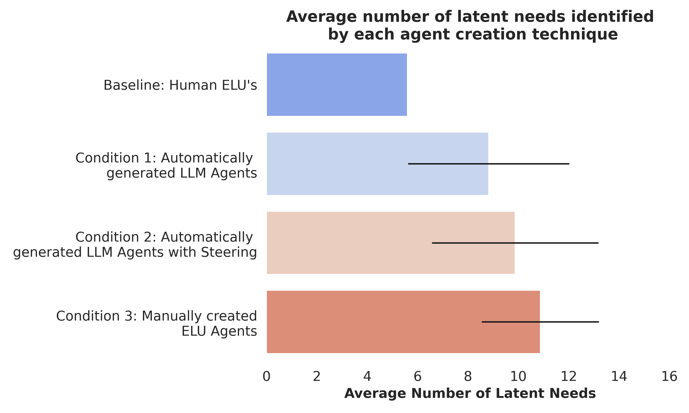

# Title
Elicitron: An LLM Agent-Based Simulation Framework for Design Requirements Elicitation

# Authors
Mohammadmehdi Ataei, Hyunmin Cheong, Daniele Grandi, Ye Wang, Nigel Morris, Alexander Tessier

# Publication Year
April, 2024

# Journal
Journal of Computing and… 4 April 2024

# Citation
7

# 背景及び先行研究との違い
これまでの商品開発におけるRequirement Elicitation(システムの要件を収集・定義するプロセス; 以下RE)は、インタビュー、フォーカスグループ、プロトタイプなどで実施しているが、時間がかかること、またユーザーのパースペクティブを完全にはとらえられないため、ユーザーニーズをとらえるのに不十分であった。その結果、商品設計やサービス設計でmisalignmentを起こしてしまっている。

本ペーパーでは、LLMを用いてREプロセスのオートメーションを目指すものである（Elicitronという）。Elicitronでは、REプロセスをstructured outputsに生成することができ、ユーザーエージェントから製品のエクスペリエンスを引き出すことができる。引き出しは、Action, Observation, Challengeステップがあり、Chain-of-Thoughts Reasoningにより引き出される。その結果、ユーザーニーズをディスカバーすることができる。加えて、Elicitronでは、潜在ニーズを引き出すことが可能である。潜在ニーズの引き出しは、empathic Lead user rolesを持つユーザーエージェントを作成することにより実現できる。

# アプローチ

### **Agent Generation**
   
各ユーザーエージェントを生成するのに以下の3つの要素がLLMにインストラクションされる
- Name: ユーザーエージェントのラベル
- Description: ユーザー特徴の説明
- Reasoning Chain：エージェントを作るRationale
  
NameとDescriptionはユーザーの特徴であるのに対して、Reasoning ChainはLLMがエージェント生成ロジックを理解するものであり、Chain of thoughtに近いプロセスである。

  1. **Parallel Agent Generation**
    N User agentsを作るためN independent promptsを作成。ただし、多くのエージェントを作ると類似してくるため、以下のKMeansにより代表的なエージェントを取得
     1. **Assign Embeddings**：Embedding vector $V_i$をエージェント$a$に与え、OpenAIの*text-embedding-ada-002*を用いた。
     2. **Perform Kmeans Clustering**：embedding vectors $V$に対して、k個のクラスタ作成。
     3. **Select Diverse Agents**：k クラスターのうち、各クラスタの代表エージェントを1名選ぶ
  2. **Serial Agent Generation**
   N User agentsを作るため、シングルプロンプトを作成。エージェントのdiversityはLLMに依存。本論文では、LLMのアウトプットのキャップが4096tokensであったため、1コール20エージェント生成するのがマックス。

### **Product Experience Generation**
   1. **Simulated Interaction**: 商品を扱った時のステップをdescribeするためのオープンエンドプロンプトが提供される。ここでは、setup, specific feature usage, troubleshouttingが行われる。
   2. **Structured Response Generation**: 以下の3つのレスポンスをエージェントは提供する。
      1. Action：取られたステップの説明（例：セットアップ、feacture activation）
      2. Observation: 各ステップにおけるエージェントのリアクションと認知。好意的な印象やフリクションなどを含む。
      3. Challenge: 直面した課題や困難を説明。ユーザーエクスペリエンスのペインポイントを見出す
    
これらのレスポンスは、この後のインタビューフェーズに持ち込まれる。

### **Agent Interview**

各エージェントにプロダクトの経験をリフレクトするプロンプトを提供し、顧客のアンメットニーズやニュアンスのきいたインサイトを発掘するためのフォローアップクエスチョンを提供する。
   1. Question Pool Creation: インタビュークエスチョン一式（人間による作成とLLMによる作成の両方）を作成し、複数の観点からプロダクトに対する質問を行う
   2. Contextualized Questioning: Prior QAのレスポンスを踏まえて、当該文脈に沿った質問を提供。

### **Latent Needs Identification**
インタビューで得られたレスポンスから、自動でニーズをisolationさせる。LLMがエージェントのインタビューをプロセスし、ニーズをextractする。Step-by-Step reasoningにより、人間の専門家によって与えられた潜在ニーズクライテリアと例を満たすまで実施される。そのうえで、LLMがすべてのファインディングをdetailed reportにまとめ、顕在ニーズと潜在ニーズに対するインサイトをオファーする。

# 実験1: User Agent Generation
### Agent Generation
20のユーザーエージェントを上記3つの手法で試し、12問の質問に対する回答でエンベディングし、クラスタリング。シルエットスコアによりdiversityを評価。評価方法はconvex hull volumeとmean distance to centroidで実施された。
$$ s = \frac{b-a}{max(a, b)}$$

Convex Hull 

Mean distance to centroid 

これらの結果、Serial Agent Generationがwin。

# 実験2: 潜在ニーズの自動生成
Empathic Lead User (ELU)インタビューテクニック(以下論文参照)を用いる。ExtraordinaryなLead Userのコンディションを捉えインタビューすることでシミュレーションすることである。
> Lin, Joseph and Seepersad, Carolyn Conner. “Empathic Lead Users: The Effects  of Extraordinary User Experiences on Customer Needs Analysis and Product Redesign.” International Design Engineering Technical Conferences and Computers and Information in Engineering Conference, Vol. 48043: pp. 289–296.  2007.

エージェントは20名生成し、以下の追加プロンプトを生成した。
> You must create non-typical users based on the following description of a typical user: “The typical user would be a weekend camper, 15-30 years old, with very good health and physical fitness, who camps a few times a year. The typical usage environment would be a public park or wilderness area, in a generally wooded or grassy environment with warm, sunny weather.”

エージェントはシミュレーション上のプロダクト経験のプロンプトを与えられ、LLMに以下のインタビュークエスチョンをする。
> Free style: “If you were to purchase an ideal tent, what main characteristics would you look for?”
> 
> Categorical: “Focusing specifically on the [category], aspect of tent, can you tell me your needs and any innovative insights to address those needs?”
Categories: size, shape, weight, material, safety, durability, aesthetics, ergonomics, cost, setup, transport

そのうえで、以下のプロンプトにより潜在ニーズを特定
> If a reported customer need represented a significant change to the product design and did not match the categories [used in interview questions], then it was labeled as a latent need. Latent needs were also identified when a reported customer need represented an innovative insight into the product and/or product usage conditions.

潜在ニーズの評価は、Raterを二名作成し、ランダム10%をindependent labelingし、discrepancyをresolveする。次にランダム20%をinter-rater agreement scoreとして計算する。最後に、残りの70%をindependent labelingを各raterに割り振る。Inter rate agreementは以下のFスコアにより算出

$$ F_1 = 2_{tp} / (2{tp}+fp+fn) $$

結果は以下のとおり。

# 考察
- エージェントはSerial Generationのが有効だったというのは以外
- ユーザーエージェントをクラスタリングして、diversityを保つというのはなかなか面白い
- 潜在ニーズを評価するには、リアルなraterを入れているが、ここもエージェント化できるはず。この評価のところが肝と思う。また、ユーザーエージェントのレスポンスもStep-by-Stepで出すことで理解度が高まるか
