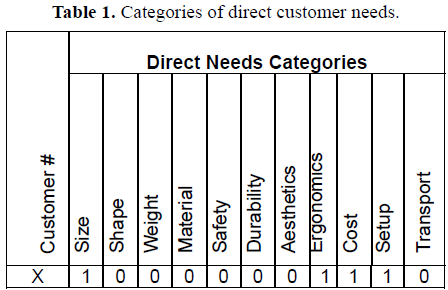
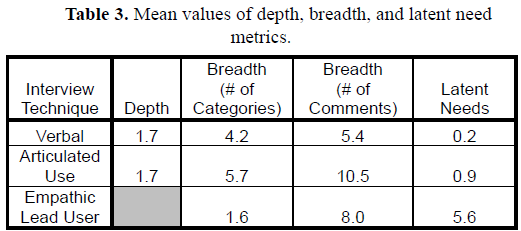
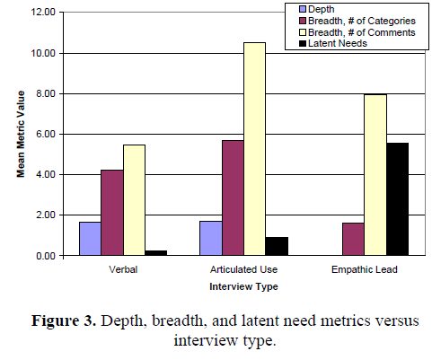

# Title
Empathic Lead Users: The Effects of Extraordinary User Experiences on Customer Needs Analysis and Product Redesign

# Authors
J. Lin, C. Seepersad

# Publication Year
January 2007

# Journal
Conference: ASME 2007 International Design Engineering Technical Conferences and Computers and Information in Engineering Conference

# Citation
79 (Accessed on Dec 27,2024)

# 背景及び先行研究との違い
トラディショナルなカスタマーニーズ分析手法として、フォーカスグループやサーベイ、インタビューなどがあるが、これらはエクスパートが行ったとしても、製品との過去の経験やアウトサイド・ザ・ボックス思考の制約があり、真にイノベーティブな発想を開発することができない。
これに対して、本研究では、*lead users*（＝製品の限界を押し広げ、一般商品者に先行するニーズを経験し、ニーズが満たされたことからベネフィットを得る）とのインタビューを通して、これらの課題を解決することである。しかし、Lead usersを多く獲得するのは、難しく、ニッチな製品だったりハイエンドな製品ではインプットが制約される。

Lead usersに加えてもう一つのソリューションは、*empathic design*であり、これは観察やインタビューを消費者自身の環境で実施することである。日常の製品の仕様やそのコンテキストを顧客が観察することで、デザイナーは消費者が認識していないようなペインを認識することができる。しかし、これらの手法はデザイナーの経験や能力に依存することがあり、顧客自身がアウトサイド・ザ・ボックス思考を持つことが難しい。

そのため、本研究では、Empathic Lead Usersにインタビューを行う。Empathic Lead Usersとは、通常の顧客であるが、製品をラディカルな新しい価値で経験し、特異なユーザーエクスペリエンスを経ることで、lead usersに変化する通常の顧客のことを指す。特異なユーザーエクスペリエンスとは、利用環境（表面、ノイズ、ライトなど）の修正や、顧客が商品とインタラクトする方法の修正（暗い環境での限られた視界、blindfolding、暗いグラス、耳栓を通じたヒアリングなど）。これらの特異なユーザーエクスペリエンスは、顧客の思考プロセスと利用パターンの型を破壊することができるため、顧客が新しい方法で製品を体験し、ブレイクスルーにつながる潜在ニーズを特定することができる。

顧客のてんけいてきなりようほうほうをプッシュし、ルーティンの使い方を破壊することで、通常のユーザーがempathic lead usersとしてイノベーターに変化することを意味する。

（原文の表現がかっこよいので引用）
>They are intended to create empathic lead users by encouraging customers (as well as designers) to push the boundaries of the typical usage environment—especially the way in which the customer interacts with the product—and physically place themselves in those settings. By breaking the routine of typical usage, empathic lead users become innovators themselves, suggesting breakthrough ideas for mainstream products.

# 研究内容
Empathic lead users　＝　特異な環境において、一般顧客が製品とインタラクトすることで、オポチュニティを創造することにより、lead usersに変換させる顧客ニーズ分析手法

Empathic lead users studyの方法

1. リデザインされる製品の特定と、リデザインのスコープ特定
2. 典型的な顧客、利用方法、利用環境の特徴の定義
3. 典型的な利用環境においてターゲットデモグラの顧客とユーザーインタビューを実施。インタビューは2つのセクションに別れ、フリースピーチインタビューと、カテゴリカルクエスチョンである。
    >**Free speech interview**: “If you were to purchase an ideal tent, what main characteristics would you look for?”

    >**Categorical questioning**: We identified eleven categories of needs for categorical questioning: size, shape, weight, material, safety, durability, aesthetics, ergonomics, cost, setup, and transport.(※これはテントのケースである旨留意)。そのうえで、次のように質問を行う。"With respect to (size/shape/weight…), can you tell me more about what you expect from the product?"

    > **Follow-up question**: “In your free speech interview, you mentioned that the product had to be small. Can you elaborate on this concern?”

4. 典型的な利用方法と利用環境において、典型的な顧客体験から外れる可能性が高い特異なユーザー体験を特定する
5. 典型的な顧客が特異な顧客体験をシミュレーションする方法を考案する。
6. シミュレートされた特異な経験についてempathic lead userインタビューを行う。シミュレート環境を再現し、顧客にフリースピーチインタビューを行う。
7. 二つのインタビューの比較と解釈。ステップ３において、顕在ニーズに関するカテゴリの回答がわかっており、もし、empathic lead usersインタビューの結果が、このリストと異なっていれば、潜在ニーズとしてラベリングされる。

# 結果

この手法により、他のユーザーと比べて、empthic lead usersは、プロトタイプありの場合は5倍の潜在ニーズを、プロトタイプなしの場合は20倍の潜在ニーズをインタビューを通じて発掘することができた。

# 考察
- out of box思考を強制的に強いる手法は興味深く、そのように特異な環境にユーザーを置くことで、5-20倍の潜在ニーズを取得することができるのは興味深い。
- エージェントに対して、インタビュイーの確保とそのdiversityが限界がある。エージェントでは顧客自体のdiversityを作り出すことができる。
