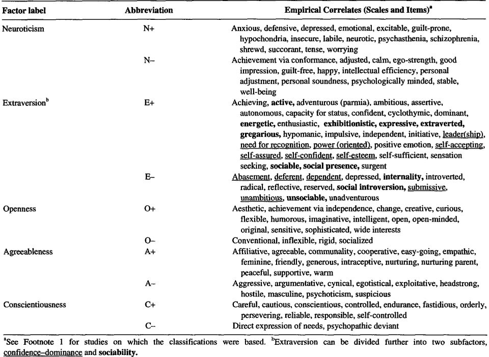
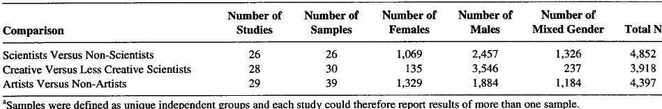
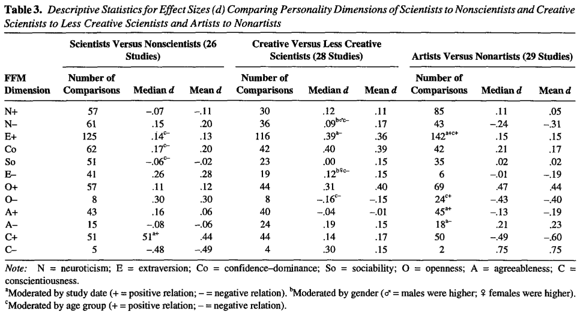
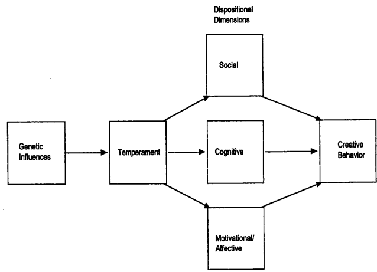

# Title
A Meta-Analysis of Personality in Scientific and Artistic Creativity

# Authors
Gregory J. Feist

# Publication Year
1998

# Journal
Personality and Social Psychology Review 1998, Vol. 2, No. 4, 290-309

# Citation
3482 

# 背景及び先行研究との違い
Five-Factor Model (or Big Five) dimensions: neuroticism, extraversion, openness, agreeablenessに基づくメタ分析。次の3つの比較がなされた（scientists versus nonscientists, more creative versus less creative scientists, andartists
versus nonartists）

# 研究内容
###Five Factor Model Trait Terms and their Empirical Personality Inventory Scale and Item Correlates

# 結果
### サンプルサイズ

### メタアナリシス結果

### 結果サマリ
創造的な人々は新しい経験に対してより開かれており、従来型にとらわれず、誠実さが低く、自信に満ち、自分を受け入れ、駆り立てられ、野心的で、支配的、敵対的、そして衝動的であることがわかった。これらの中で、最も大きな影響を与えるのは、開放性、誠実性、自己受容、敵対性、そして衝動性である。さらに、これらの創造的な人々の特異な人格の次元には時間的な安定性があると考えられる。創造的な行動に重要な性向は、社会的、認知的、動機的、感情的な次元に分けられる。創造性は、ほとんどの複雑な行動と同様に、学際的および分野内の視点を必要とし、それによって人格心理学者や社会心理学者の歴史的な分野中心の態度を和らげる。

# ディスカッション

Figure 4. Modelofthe plausible mechanisms underlying the influence of personality on creative behavior.
