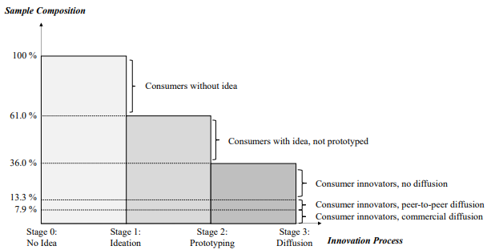
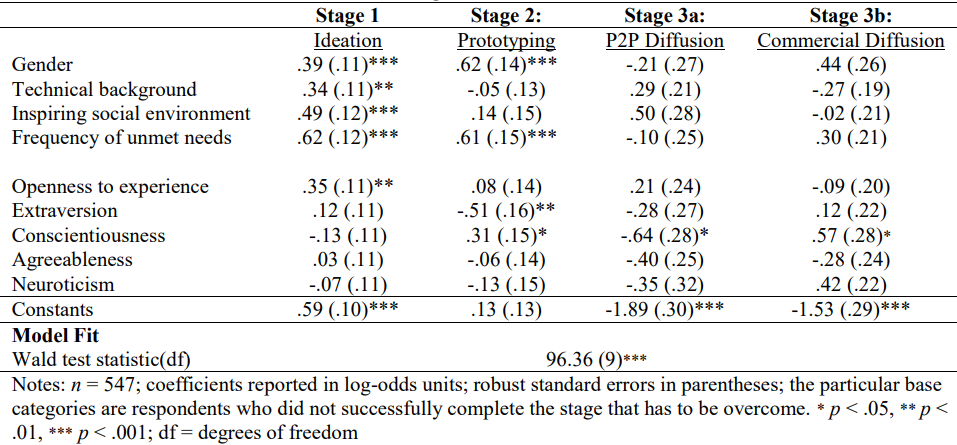
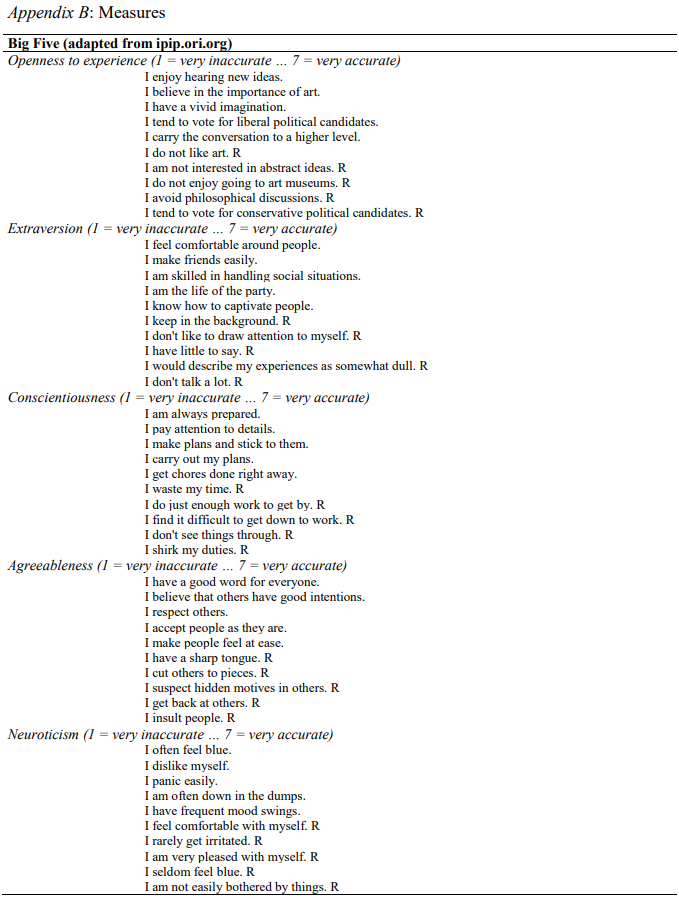

# Title
Impacts of Personality Traits on Consumer Innovation Success

# Authors
R. Stock, E. von Hippel, N. Gillert

# Publication Year
2014
# Journal
2014, Psychology of Innovation eJournal

# Citation
89

# 背景及び先行研究との違い
これまでイノベーションの普及プロセスを論じる研究はあったが、そのプロセスに個人の性格がどのように起因しているかを評価するものがなかった。本論文では、イノベーションの普及を、idea→prototype→diffusionの以下の3ステップでとらえ、その3ステップに個人の性格としてbig five理論の性格がどのように寄与しているか研究したものである。
1. generating an idea for a new product or product improvement
2. developing a prototype that implements that idea, and
3. diffusing the innovation to others.

# 研究内容
本調査ではドイツ人の消費者547名にアンケートを提供し、性格診断は50-itemのInternational Personality Item Poolによって行われた。以下が調査結果であり、イノベーションのプロセスが進むにつれて、サンプル割合が減っていくものであるのは仮説に見合っている。

Figure 1: Data analysis strategy: comparison of individuals accomplishing vs. not accomplishing successive innovation process stages. 

なお、Big Fiveの定義は以下のとおり。

**Openness to experience**：経験への開放性は「知的好奇心が強く、新しい経験を求め、新しいアイデアを探求する傾向がある人を特徴づける」(Zhao and Seibert 2006, p. 261)とされています。経験への開放性が高い個人は、創造的で想像力に富み、好奇心旺盛で伝統にとらわれないと表現できます（George and Zhou 2001; McCrae and Costa 1985）。また、哲学的な思索を好み、芸術を鑑賞する傾向もあります（McCrae and John 1992）。一方で、経験への開放性が低い個人は、伝統的で興味の幅が狭く、冒険心が乏しく、分析的でないと特徴づけられます（McCrae and Costa 1987）。

**Extraversion**：外向性は「人がどの程度自己主張的で支配的、エネルギッシュ、活動的、おしゃべりで熱意に満ちているか」を示す（Zhao and Seibert 2006, p. 260）。外向的な人々は社会的な活動を楽しみ、単独でいるよりも他者と一緒にいることを好む（LePine and Van Dyne 2001）。対照的に、内向的な人々は社会的な関与が低いが、それでも暖かさや親密な感情的つながりを伴う社会的状況を重視する（Lucas et al. 2000）。

**Conscientiousness**：誠実性は、「個人の組織力、忍耐力、勤勉さ、および目標達成に向けた動機づけの程度を示すもの」である（Zhao and Seibert 2006, p. 261）。誠実性の高い人は、信頼性や自己規律、外部の期待を超える達成動機を持つことを意味する（例：Mount and Barrick 1995）。誠実性のスコアが高い個人は、計画的で体系的な行動を好み、突発的な行動を避ける傾向がある（Barrick, Mount, and Judge 2001）。

**Agreeableness**：協調性は、個人の対人関係の指向性を示すものであり、ポジティブな対人関係と協力を好む傾向を含みます（Digman 1990; Zhao and Seibert 2006）。協調性の高い人は、社会的慣習に従順で、従順で、信頼しやすく、許しやすく、謙虚で、心優しく、寛容であると関連付けられており、より協力的で質の高い対人関係を築くことが示されています（Barrick and Mount 1991; Costa and McCrae 1992）。この次元の非常に低い端にいる人は、自己中心的で、疑い深く、敵対的であると特徴付けられます（Feist 1998）。

**Neuroticism**：神経症的傾向は、「感情の調整がうまくできず、不安感、不安定感、敵意などのネガティブな影響を受けやすい傾向を示す」（Judge et al. 2002, p. 767）ことを意味します。神経症的傾向のスコアが高い人は、緊張しやすく、しばしばネガティブな態度を表現し、社会的な場面での他者との交流の質が低いことがあります（LePine and Van Dyne 2001）。神経症的傾向の反対は情緒安定性であり、個人がどれだけ落ち着いていて、忍耐強く、安心感を持ち、調整が取れているかを指します（Feist 1998; McCrae and Costa 1987）。

# 結果
Big Five理論とイノベーションのサクセスに関するファインディングは以下のとおり。なお、Big Fiveは、Openness to Experience, Extraversion, Conscientiousness, Agreeableness, neuroticismに分かれる。
1. Big FiveでOpenness to experienceの特徴が高い人は、新しいプロダクトアイデアを生み出している。（IdeaステップはOpenness to experience特徴に依存する）
2. IntrovertedでConscientiousnessな人は、アイデアを個人利用向けのプロトタイプとして実現するのと関連性が高い（Prototypeステップは、IntroversionとConscientiousnessの特徴に依存する）
3. Conscientiousnessが高い人は、商業的にイノベーションを普及させるが、Peer-topeerの普及には向いていない（Diffusionプロセスで、商業的な普及はConscientiousnessの特徴に依存する）

Table 3: Effect of personality on consumer innovation and diffusion: Standardized sequential logit estimates

### Idea Generation
全体の回答者の10.5%がIdeationに成功している。Openness to experienceが1ユニット上がると、アイデアを持つ可能性が51%高まる。同様に、Openness to experienceが1ユニット上がると、Stage1のidea generationをクリアする確率が9.48%高まる。また、男性であること、技術的なバックグラウンドを持つこと、Social Environmentにインスパイアされる人もIdea Generationにポジティブな影響を与える。加えて、アイデアジェネレーションの段階では、コラボレーションは重要ではなく、コラボレーションインテンシティの高い人と、高くない人との間でアイデアジェネレーションに対する統計的有意性は認められなかった。

### Prototype
プロトタイプの成功には、Big Fiveの性格により、8％の寄与が認められた。まず、Introvertであることは、プロトタイプの成功に強い影響を与える。Extraversionの1ユニットの上昇は、プロトタイプ作成の確立が46%低くなる。同様に、Extraversionの1ユニットの上昇はプロトタイプの成功の確率を15%引き下げる。次に、conscientiousnessであることはプロトタイプの成功に重要な要素となっている。conscientiousnessの1ユニットの上昇は、Stage２のPrototypeの成功確率を10%高める。プロトタイプの段階でも、他者からのサポートは重要ではなく、他者からのサポートが重要という仮説も統計的有意性を持たなかった。

### Diffusion
1. Commercial Diffusion
   1. Big Fiveは9.1%寄与しており、多くはconscientiousnessである。conscientiousnessの1ユニットの上昇は、Commercial Diffusionの確率を101%引き上げる。同様に、onscientiousnessの1ユニットの上昇は、商業化を11%引き上げる。
2. Peer-to-Peer Diffusion
   1. Big Fiveは13.1%寄与しており、conscientiousnessが低い消費者がpeer-to-peerイノベーションを引き上げる。conscientiousnessの1ユニットの上昇は、peer-to-peerのグループにいる確率が55%高まる。同様にconscientiousnessの1ユニットの上昇は、peer-to-peerのdiffusionの確率を9%引き上げる。

### Idea GenerationとPrototypeの二つを成功する性格
#### Stage1とStage2を両方クリアする性格
- Openness to ExperienceとConscientiousnessを90パーセンタイルとし、Extraversionを10パーセンタイルに設定すると、Stage1(Idea Generation)とStage2(Prototype)を完了する確率は52.9%となる。反対に、Low openness to experienceとLow Conscientiousness(10パーセンタイル)にし、高いExtraversion（90パーセンタイル）にすると、Stage1とStage2をクリアする確率は16.1%に落ちる。

#### Stage1-Stage3をクリアする性格
##### Commecial Diffusion
- Openness to ExperienceとConscientiousnessを90パーセンタイルとし、Extraversionを10パーセンタイルに設定すると、Stage1からStage3(Commercial Diffusion)までクリアする確率は、12.4%となる。反対に、Low openness to experienceとLow Conscientiousness(10パーセンタイル)にし、高いExtraversion（90パーセンタイル）にすると、Stage1からStage3(Commercial Diffusion)までクリアする確率は、1.7%となる。よって、成功確率の高い性格と低い性格のさは、７倍となる。

##### Peer-to-Peer Diffusion
- Peer-to-Peer Diffusionの成功に関連する性格（Openness to Experienceを90パーセンタイルとし、ConscientiousnessとExtraversionを10パーセンタイルに設定）は、Stage3のPeer-to-Peerの成功確率は、17.5%となる。逆の性格の場合の成功確率は、0.5%であるため、差分は35倍となる。
- 次に、ConscientiousnessがPeer-to-Peer diffusionでは強い影響を与えていたので、Openness to ExperienceとConscientiousnessを90パーセンタイルとし、Extraversionを10パーセンタイルに設定すると、Peer-to-Peerの成功確率は4.5%となる。これは、上記のLow Conscientiousnessと比べて、４分の１である。

# 考察
- イノベーションプロセスを3段階に分け、性格がどのように寄与したかを分析する論文として非常に有用なもの

論文リンクはこちら
https://dspace.mit.edu/bitstream/handle/1721.1/123986/von%20Hippel_Impacts%20of.pdf?sequence=2&isAllowed=y

#  参考
Big Fiveのクエスチョネア

