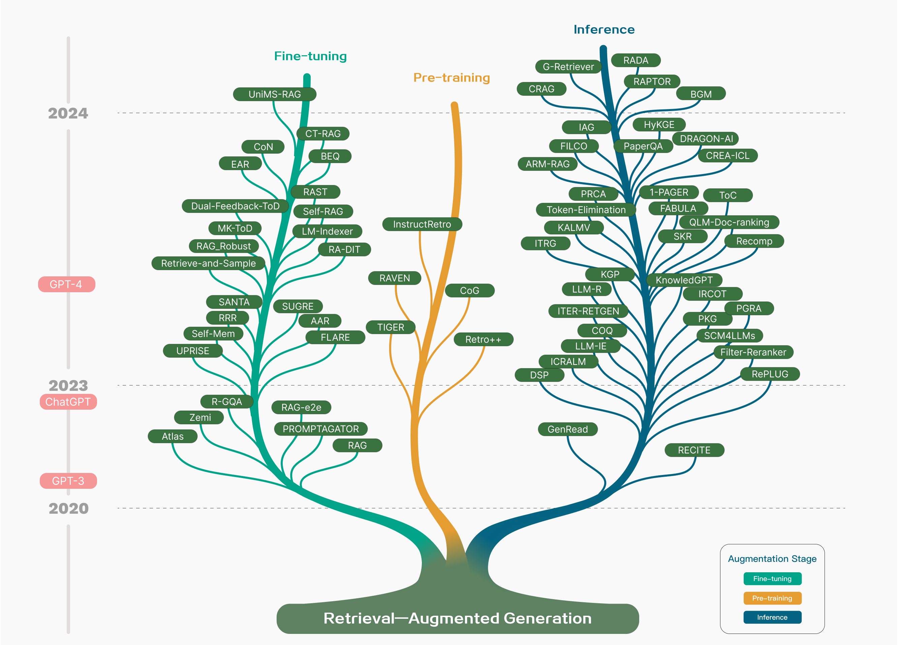
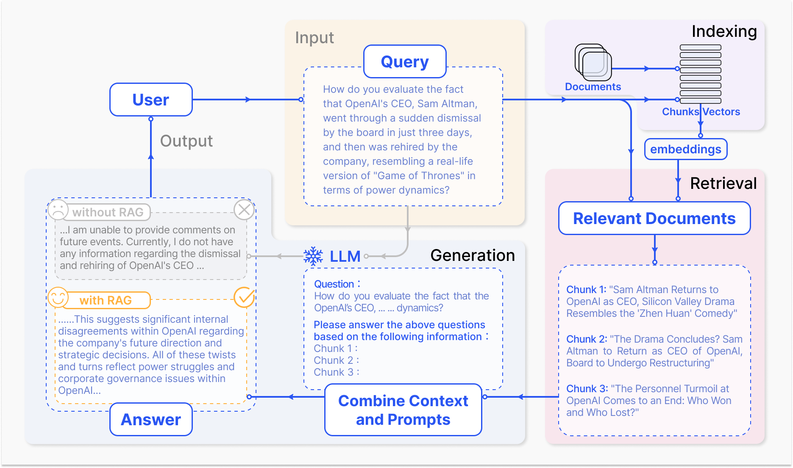
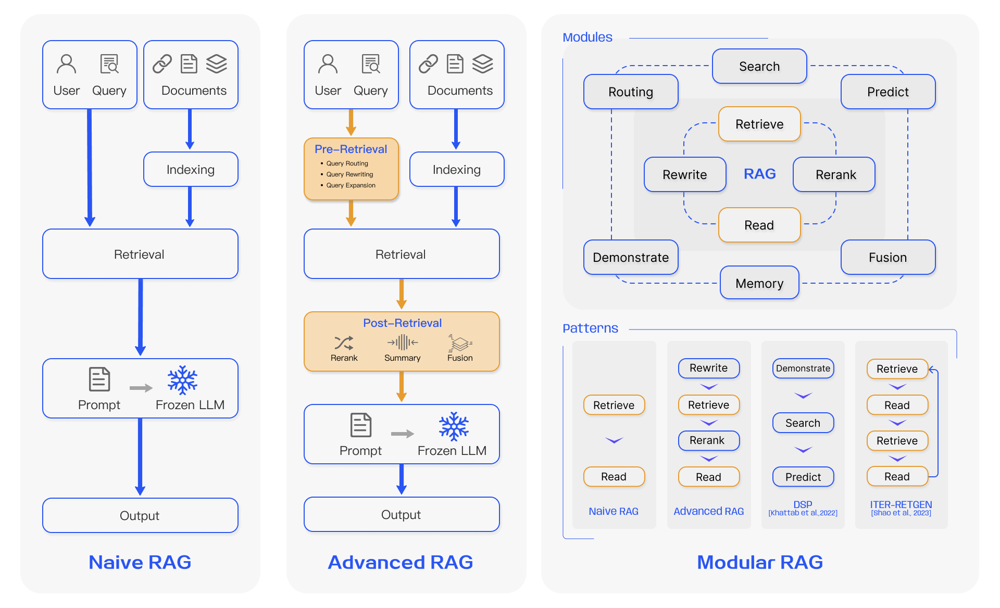
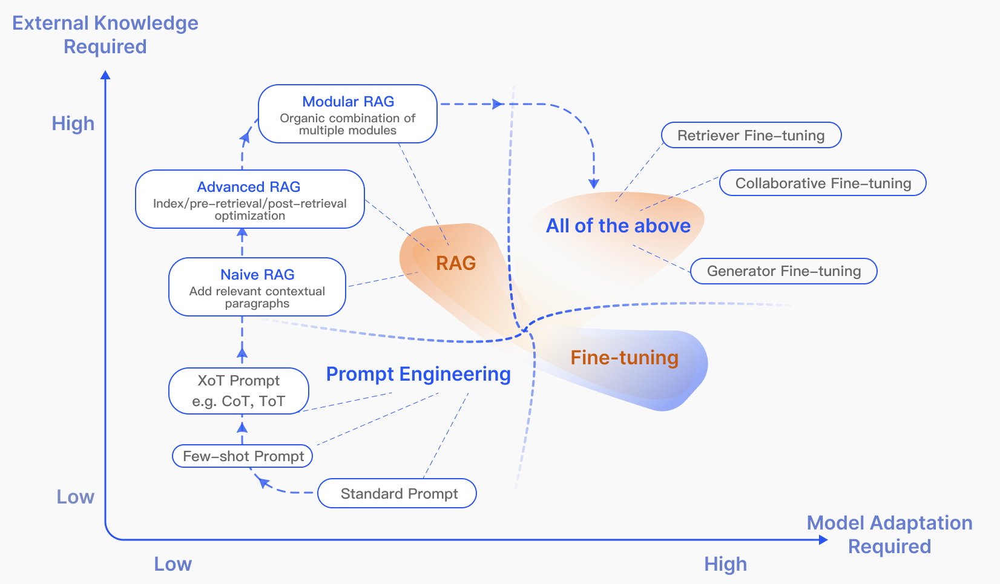
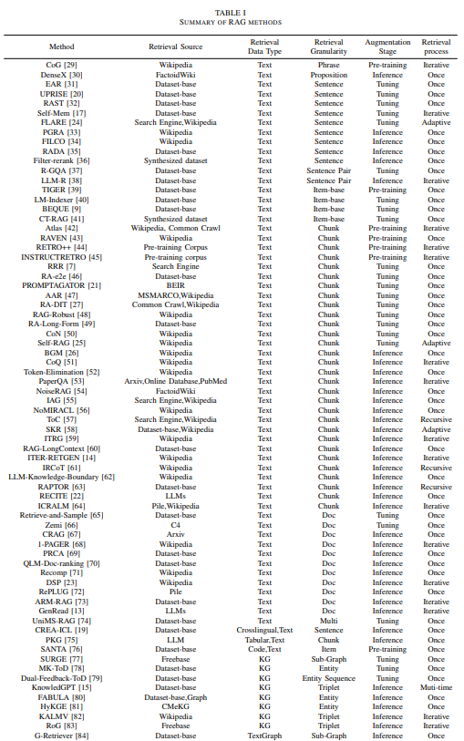

# Title
Retrieval-Augmented Generation for Large Language Models: A Survey

# Authors
Yunfan Gao, Yun Xiong, Xinyu Gao, Kangxiang Jia, Jinliu Pan, Yuxi Bi, Yi Dai, Jiawei Sun, Meng Wang, Haofen Wang

# Publication Year
December 2023

# Journal
arXiv.org 18 December 2023

# Citation
871

# 背景及び先行研究との違い
RAGの手法に関するレビュー論文

# 研究内容

Figure 1:Technology tree of RAG research. The stages of involving RAG mainly include pre-training, fine-tuning, and inference. With the emergence of LLMs, research on RAG initially focused on leveraging the powerful in context learning abilities of LLMs, primarily concentrating on the inference stage. Subsequent research has delved deeper, gradually integrating more with the fine-tuning of LLMs. Researchers have also been exploring ways to enhance language models in the pre-training stage through retrieval-augmented techniques.

# 1 Overview of RAG
典型的なRAGのパターンは以下のとおり。

Figure 2:A representative instance of the RAG process applied to question answering. It mainly consists of 3 steps. 1) Indexing. Documents are split into chunks, encoded into vectors, and stored in a vector database. 2) Retrieval. Retrieve the Top k chunks most relevant to the question based on semantic similarity. 3) Generation. Input the original question and the retrieved chunks together into LLM to generate the final answer.

RAGは、Naive RAG, Advanced RAG, Modular RAGの3ステージに分けられる。Naive RAGは費用対効果が高いが制約もあるため、Advanced RAGやModular RAGが生まれてきた。

Figure 3:Comparison between the three paradigms of RAG. (Left) Naive RAG mainly consists of three parts: indexing, retrieval and generation. (Middle) Advanced RAG proposes multiple optimization strategies around pre-retrieval and post-retrieval, with a process similar to the Naive RAG, still following a chain-like structure. (Right) Modular RAG inherits and develops from the previous paradigm, showcasing greater flexibility overall. This is evident in the introduction of multiple specific functional modules and the replacement of existing modules. The overall process is not limited to sequential retrieval and generation; it includes methods such as iterative and adaptive retrieval.

## 1. Naive RAG
Naive RAGはもっとも初期の方法であり、ChatGPTの到来の後にすぐに広がった。Naive RAGは、indexing, retrieval, generationのプロセスで構成され、“Retrieve-Read” frameworkと呼ばれる。

- *Indexing*: PDF, HTML, Word, MarkdownなどのRaw Dataを取得・クリーニングし、プレーンテキストフォーマットに変換することから始まる。Language Modelsのコンテキストの制約を受け、テキストは、smallerでdigestible chunksに分割される。チャンクは、その後エンベディングモデルによりVector化され、ベクターデータベースに補完される。
- *Retrieval*: ユーザークエリを受け、RAGシステムはindexingフェーズで用いたのと同じエンコーディングモデルを用いる。クエリベクターと、インデックス化されたコーパス内のVector Chunksの類似スコアを計算する。その上で、クエリにもっとも類似するtop KのチャンクをRetrieveする。これらのチャンクはプロンプトのexpanded contextとして使われる。
- *Generation*: クエリと選択されたドキュメントは、LLMがレスポンスを生成するのに必要ンあ一貫したプロンプトにシンセサイズされる。

**Native Ragの課題**
- *Retrieval Challenges*: Retrieval PhaseでPrecision/Recaallを混乱し、誤った／不適当なチャンクを引っ張ってきてしまう
- *Generation Difficulties*: レスポンスを生成するときに、ハルシネーションを起こしてしまう。
- *Augmentation Hurdles*: Retrieveされた情報を異なるタスクにインテグレートする際に混乱を起こす。同じような情報が異なるソースから引っ張られることによって、redundancyが与えられ、Repetitiveなレスポンスを引き起こす。
- *Limited Insight*: 多くがGeneration時のaugmented informationに依存しており、アウトプットが新しいインサイトや情報のシンセサイズにつながらず、有用な情報が得られない。

## 2. Advanced RAG
Advanced RAGはNaive RAGの欠点を補完する改善を行ったものである。Retrievalのクオリティを引き上げるために、Pre-retrievalとPost-Retrieval strategiesを採用している。Indexingの課題には、Advanced RAGはSliding Window approach、fine-grained segmentation, incorporation of metadataにより改善をした。

- *Pre-retrieval Process*: Indexing structureを最適化するためのもの。方法として、data granularityの改善、インデックスストラクチャの最適化、メタデータの追加、alignment optimization、mixed retrievalがある。

    >I. ILIN, “Advanced rag techniques: an illustrated overview,” https://pub.towardsai.net/advanced-rag-techniques-an-illustrated-overview-04d193d8fec6, 2023.

    > X. Ma, Y. Gong, P. He, H. Zhao, and N. Duan, “Query rewriting for retrieval-augmented large language models,” arXiv preprint arXiv:2305.14283, 2023.

    > W. Peng, G. Li, Y. Jiang, Z. Wang, D. Ou, X. Zeng, E. Chen et al., “Large language model based long-tail query rewriting in taobao search,” arXiv preprint arXiv:2311.03758, 2023.
    
    >H. S. Zheng, S. Mishra, X. Chen, H.-T. Cheng, E. H. Chi, Q. V. Le, and D. Zhou, “Take a step back: Evoking reasoning via abstraction in large language models,” arXiv preprint arXiv:2310.06117, 2023.
    
    >L. Gao, X. Ma, J. Lin, and J. Callan, “Precise zero-shot dense retrieval without relevance labels,” arXiv preprint arXiv:2212.10496, 2022.

- *Post-Retrieval Process*: コンテキストがretrieve出来たら、適切にクエリとインテグレートすることが必要。Post-Retrievalには、Rerank Chunks,とContext Compressingがある。Retrieveした情報のRe-rankingは、プロンプトの最適な内容をリローケートするもの。例えば、LLamaindex, Langchain, Haystackで実装されている（下記論文）。Context Compressingは、すべての情報をLLMに突っ込むと関係のない情報の詳細にフォーカスが当たり内容がDiluteしてしまうので、不可欠な情報を選択するよう集中させ、クリティカルなセクションを強調し、コンテクストをshorteningすることである。

    > V. Blagojevi, “Enhancing rag pipelines in haystack: Introducing diversityranker and lostinthemiddleranker,” https://towardsdatascience.com/enhancing-rag-pipelines-in-haystack-45f14e2bc9f5, 2023.

## 3. Modular RAG
Naive RAGとAdvanced RAGのさらなる改良版。類似性の検索にSearch Moduleを追加する、ファインチューニングを通じたRetrieverのリファイニングがある。Restructured RAG Modules（下記論文1）やRearranged RAG Pipelines（下記論文2）は、特定のチャレンジを改善するのに導入された。Modular RAGは、徐々に主流化されてきており、Sequential ProcessingやIntegrated end-to-end trainingに使われている。

    > 論文1: W. Yu, D. Iter, S. Wang, Y. Xu, M. Ju, S. Sanyal, C. Zhu, M. Zeng, and M. Jiang, “Generate rather than retrieve: Large language models are strong context generators,” arXiv preprint arXiv:2209.10063, 2022.

    > 論文2：Z. Shao, Y. Gong, Y. Shen, M. Huang, N. Duan, and W. Chen, “Enhancing retrieval-augmented large language models with iterative retrieval-generation synergy,” arXiv preprint arXiv:2305.15294, 2023.

### 3-1. New Modules
さらなるadditionalなSpecialized Componentsを、RetrievalとProcessingの能力を高めるのに作成する。
- **Search Module**は、特定のシナリオを適応し、様々なデータソースを横断した直接の検索を可能にする（論文1）。RAG-Fusionは、マルチクエリストラテジーを採用し、ユーザークエリを様々な観点から拡大し、並列でのベクトルサーチの活用と、ExplicitでかつtransformativeなナレッジをuncoverするためのRe-rankingを実施する(論文2)。
- **Memory Module**は、LLMのメモリにRetrievalをガイドし、イテラティブなself-enhancementを通じたデータ分布により近い無制限のメモリプールを作成する（論文3, 4）。Routing in the RAG systemは、多様なデータソースをナビゲートし、クエリに対して最適なパスウェイを見つける（論文5）。
- **Predict Module**は、LLMを通じたコンテクストのジェネレーションにおけるRedundancyとノイズを減らし、relevanceとaccuracyを改善するもの（論文6）。
- **Task Adapter Module**は、下流工程のタスクに対してであり、zero-shotインプットでのプロンプトリトリーバルを自動化し、few-shotクエリ生成を通じて特定のRetrieverを作成する（論文7, 8）
    > 1. X. Wang, Q. Yang, Y. Qiu, J. Liang, Q. He, Z. Gu, Y. Xiao, and W. Wang, “Knowledgpt: Enhancing large language models with retrieval and storage access on knowledge bases,” arXiv preprint arXiv:2308.11761, 2023.
    > 2. A. H. Raudaschl, “Forget rag, the future is rag-fusion,” https://towardsdatascience.com/forget-rag-the-future-is-rag-fusion-1147298d8ad1, 2023.
    > 3. X. Cheng, D. Luo, X. Chen, L. Liu, D. Zhao, and R. Yan, “Lift yourself up: Retrieval-augmented text generation with self memory,” arXiv preprint arXiv:2305.02437, 2023.
    > 4. S. Wang, Y. Xu, Y. Fang, Y. Liu, S. Sun, R. Xu, C. Zhu, and M. Zeng, “Training data is more valuable than you think: A simple and effective method by retrieving from training data,” arXiv preprint arXiv:2203.08773, 2022.
    > 5. X. Li, E. Nie, and S. Liang, “From classification to generation: Insights into crosslingual retrieval augmented icl,” arXiv preprint arXiv:2311.06595, 2023.
    > 6. W. Yu, D. Iter, S. Wang, Y. Xu, M. Ju, S. Sanyal, C. Zhu, M. Zeng, and M. Jiang, “Generate rather than retrieve: Large language models are strong context generators,” arXiv preprint arXiv:2209.10063, 2022.
    > 7. D. Cheng, S. Huang, J. Bi, Y. Zhan, J. Liu, Y. Wang, H. Sun, F. Wei, D. Deng, and Q. Zhang, “Uprise: Universal prompt retrieval for improving zero-shot evaluation,” arXiv preprint arXiv:2303.08518, 2023.
    > 8. Z. Dai, V. Y. Zhao, J. Ma, Y. Luan, J. Ni, J. Lu, A. Bakalov, K. Guu, K. B. Hall, and M.-W. Chang, “Promptagator: Few-shot dense retrieval from 8 examples,” arXiv preprint arXiv:2209.11755, 2022.

### 3-2. New Patterns
Modular RAGは、Module SubstitutionやReconfigurationができるadaptabilityを持っている。
- Rewrite-Retrieve-Read: Rewriting ModuleとモデルのRewritingをアップデートするLM-FeedbackメカニズムによりRetrieval Queriesを改善するもの（論文1）
- Generate-Read: トラディショナルなretrievalを、LLMが生成したコンテントにreplaceする（論文2）
- Recite-Read：モデルウェイトからretrievalを強調し、ナレッジインテンシブなタスクの能力を改善させる（論文3）
- HyDE: generated answeresとリアルドキュメントの類似度をエンベディングし、retrieval relevanceを改善するもの（論文4）
- Demonstrate-Search-Predict (DSP)／Retrieve-Read-Retrieve-Read (ITER-RETGEN)：ダイナミックなモデルアプトプットの利用がほかのモジュールのファンクファンクショナリティを強化し、モジュールのシナジーを改善するもの（論文5, 6）
- FLARE/Self-RAG：Fiixed RAG Retrieval Processを異なるシナリオに基づき、retrievalの必要性を評価しretrieval processを改善するもの

    >1. X. Ma, Y. Gong, P. He, H. Zhao, and N. Duan, “Query rewriting for retrieval-augmented large language models,” arXiv preprint arXiv:2305.14283, 2023.
    >2. W. Yu, D. Iter, S. Wang, Y. Xu, M. Ju, S. Sanyal, C. Zhu, M. Zeng, and M. Jiang, “Generate rather than retrieve: Large language models are strong context generators,” arXiv preprint arXiv:2209.10063, 2022.
    >3. Z. Sun, X. Wang, Y. Tay, Y. Yang, and D. Zhou, “Recitation-augmented language models,” arXiv preprint arXiv:2210.01296, 2022.
    >4. L. Gao, X. Ma, J. Lin, and J. Callan, “Precise zero-shot dense retrieval without relevance labels,” arXiv preprint arXiv:2212.10496, 2022.
    >5. O. Khattab, K. Santhanam, X. L. Li, D. Hall, P. Liang, C. Potts, and M. Zaharia, “Demonstrate-search-predict: Composing retrieval and language models for knowledge-intensive nlp,” arXiv preprint arXiv:2212.14024, 2022.
    >6. Z. Jiang, F. F. Xu, L. Gao, Z. Sun, Q. Liu, J. Dwivedi-Yu, Y. Yang, J. Callan, and G. Neubig, “Active retrieval augmented generation,” arXiv preprint arXiv:2305.06983, 2023.

## 4. RAG vs Fine-tuning
RAGはよくファインチューニング（FT）とプロンプトエンジニアリングと比較される。それぞれの手法は、下記画像のとおりそれぞれの特徴を持っている。

Figure 4:RAG compared with other model optimization methods in the aspects of “External Knowledge Required” and “Model Adaption Required”. Prompt Engineering requires low modifications to the model and external knowledge, focusing on harnessing the capabilities of LLMs themselves. Fine-tuning, on the other hand, involves further training the model. In the early stages of RAG (Naive RAG), there is a low demand for model modifications. As research progresses, Modular RAG has become more integrated with fine-tuning techniques.

RAGは、リアルタイムの知識のアップデートやexternal knowledgeの効果的な活用において有用。しかし、higher latencyやethical considerationsがあるのが課題。Fine tuningはよりstaticで、アップデートに再学習が必要だが、モデルのベヘイビアーやスタイルの深いカスタマイズが可能。ただし、莫大なコンピューターリソースが必要。多くのナレッジインテンシブなタスクにおけるテスト結果では、fine-tuningは一定の改善は示せるが、RAGが一貫して既存知識の活用や新知識の活用という点でoutperformしている。RAGとFine-tuningのチョイスは、データのダイナミック性、カスタマイズ、コンピューターリソースといった特定のニーズによって変わってくる。

**SUMMARY OF RAG METHODS**

# 2 RETRIEVAL

# 結果
NA(レビュー論文のため)

# 考察
NA(レビュー論文のため)
