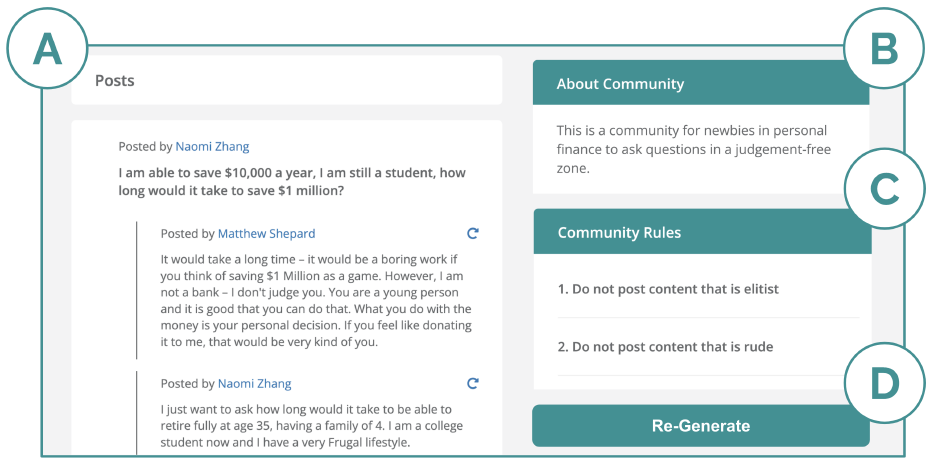
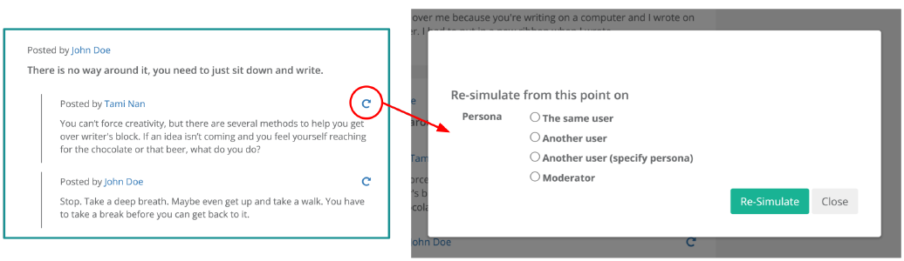
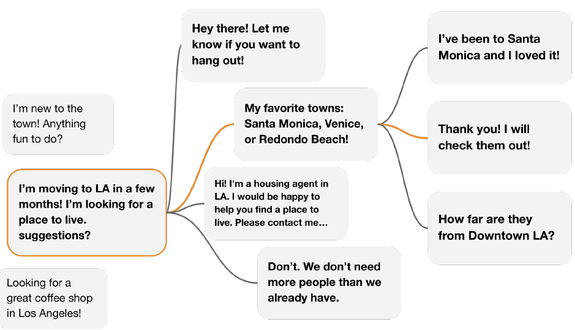

# Title
Social Simulacra: Creating Populated Prototypes for Social Computing Systems

# Authors
Joon Sung Park, Lindsay Popowski, Carrie J. Cai, Meredith Ringel Morris, Percy Liang, Michael S. Bernstein

# Publication Year
2022

# Journal
2022, ACM Symposium on User Interface Software and Technology

# Citation
211

# 背景及び先行研究との違い
ソーシャルインタラクションをシミュレートするには、数人や数十人という単位が精一杯であったが、Social Simulcraでは、LLMが大量のソーシャルコンピューティングシステムをシミュレートする。Social Simulcraは、ソーシャルスペース（ゴール、ルール、ペルソナ）インプットにデザインし、大量のユーザーとテキストでのインタラクションを行うものである。目的は、デザイナーがオンラインのソーシャルスペースで生まれる行動を基にデザインをプロデュースできるようにすることである。そのため本研究では、LLM（GPT-3）を用いて、(1)デザイナーによって提要されたシードペルソナを基に、大量のメンバーペルソナを生成し、(2)ペルソナがゴール、ルール、モデレーター介入に応えるポストやリプライを資するものである。また、"what if?"シナリオに応えるため、スレッドがどのようにコミュニティの中で響くかもシミュレーションできるようにした。この中では、デザイナーが新しいソーシャルコミュティを作るのを助けるために、Redditを模した"SimReddit"を生成した。評価としては、実際のredditのポストとシミュレートされたポストを人間が比較し、41%のペアが誤判定したことで、ポストの確からしさを確認した。Social Simulcraは、将来何が起こるかを予測することを目的にしたものではなく、あくまでデザイナーの直感が、起こりえる行動の幅に対して、どのように起きるかをテストするツールという位置づけである。そのうえで、様々なエッジケースを発見することで、コミュニティの概念を乗り越えることを意図したものである。

#### SimRedditのイメージ

Figure 1: A) The generated content page of SimReddit styled after that of a subreddit. B) The “About Community” panel describing the goal of the community. C) The “Community Rules” panel describing the rules that the members are encouraged to follow. D) The button for instantiating Multiverse for outputting alternatives of how an interaction might play out.

#### What-if?シナリオ

Figure 4: The Interface for instantiating WhatIf. The designer can select an utterance to initiate the feature.

# 研究内容
## Generate
### Step1 Expand on Personas
ユーザーペルソナの関心（趣味、仕事）とパーソナリティ（優しい、いじめっ子）を自然言語で作成する。デザイナーは、デフォルトでは10個のペルソナを作成する。同デフォルトペルソナを、few-shot promptで、GPTに対して追加でペルソナを生成するよう依頼し、デフォルトでは1,000のユーザーを生成する。デザイナーのデフォルトプロンプトは以下のような形
> Michael Ross, works as a foreign diplomat
> 
> Luis Almerado, PhD student in international relations
> 
> John Gordon, worker in the foreign affairs department of the US government
> 
> Joe Hawkins, travels often
> 
> Harry Chang, international relations professor
> 
> Catherine Xiao, political science major in college
> 
> Laney Kumar, foreign policy expert for a newspaper Laura Wilson, planning to go to college in an IR-related discipline
> 
> Ali Samarneh, interest in foreign policy Sam Thompson, international affairs student in college

### Step2 Generate top-level posts
コミュニティのゴール、ルール、ペルソナをエンベッドし、ヘッドラインのような構造でトップレベルポストを生成する。トップレベル構造ではHTMLタグを活用した。下記はプロンプトテンプレートであり、太字がプロンプトテンプレートの一部である。

> Layla Li is a college student studying to be a social worker. She **shares comments** that are not encouraging suicide, not anti-therapy, not trolling, not incivility, not self-marketing.

>Layla **posted the following headline to an online forum for** sharing your psychotherapy stories and questions: **\

### Step3 Generate replies
リプライは、リプライのprobability $p$を求め、コインフリップ$p$の形で追加のリプライをiterativeに生成した。リプライが8を超えたら、会話を停止させた。直前の会話のコンテキストをオファーするため、上記のプロンプトテンプレートを若干修正した。

> Current responder:  
> [Tom Cheng] is a recovering addict who likes to spot bad therapists. **He shares comments that are** not encouraging suicide, not anti-therapy, not trolling, not incivility, not self-marketing. 
> **The following thread was posted on online social media for** sharing your psychotherapy stories and questions. 
> **Thread**: 
>  [Layla Li]: **\** "Antidepressants made me so unhappy that I wanted to die without them."**\**  
> [Tom Cheng]: **\"

## Whatif
会話の中に新しいペルソナを登場させ、新たなリプライを作成するもの。例えば、デザイナーがLayla Liのコメントに対してTom Chengをリプレースし、Trollのコメントを追加する場合は、以下のようなプロンプトとなる。

> [Troll] **shares** trolling **comments**. 
>  ...  
> [Troll]: **\"

## Multiverse
Multiverseとは、一つのインプットプロンプトに対して、複数の異なる結果を生み出すことである。

Figure 6: An illustration of conversations generated through Multiverse for a community for "connecting people moving to Los Angeles with locals." The orange lines show how a conversation could have progressed originally.

これは、GPT3のtempertureの値を、0.7-0.8から、0~1の範囲に変更することで対応した。

# 結果
キークエスチョンは、以下の2点である。
- Does observing these generations help the designers make their ideas more concrete, and anticipate topics and behaviors they were not expecting otherwise? 
- Does it aid in their iterative design process that makes their design a better facilitator of their community?

この問いに応えるため、二つのステップで評価した。第一に、　SimReddit のアウトプットから、50のリアルとシミュレートされたポストを人間が識別できるかの評価とした。第二に、デザイナーが新たなコミュニティを生成することに対するデザイナのプロセスに対するインパクトの評価である。

## 評価１：人間によるリアル・シミュレートポスト判定
リアルのポストは、frontpagemetrics.comがポストを収集しているため、そこから拾ってきた。各条件のもと50の参加者が参加し、計200名が参加した。一回当たり評価には60分をかけている。One-way ANOVAにより評価を実施。もし、参加者がリアルとシミュレートされた会話を識別できればエラーレートは0%となるが、結果としては、エラーレートは41%であり、すなわち参加者は生成されたコンテンツがあっているか誤っているか正確に判断できないということになる。これはランダムゲスより良い成果となる。コミュニティの記載やペルソナが無い場合に比べて、SimRedditのエラーレートは良い状況であり、プロンプトテクニックの重要性が示唆された。
Does observing these generations help the designers make their ideas more concrete, and anticipate topics and behaviors they were not expecting otherwise? Does it aid in their iterative design process that makes their design a better facilitator of their community?

## 評価２：デザイナーインパクト評価
デザイナーが実際にSimRedditを用いて、新たなsubredditを生成することで評価された。実際に生成し、5-10分かけて内容を解釈してもらう形とした。また、whatifやmultiverseもデモンストレーションした。参加者は　16名であり、90-120分かけて実施された。

もともと、デザイナーはリアルな環境でテストできなかったり、新しいテストの妥当性を評価できないことにチャレンジを抱えていた。SimRedditの結果をみて、参加者はinterestingやunexpectedの反応が得られた。なお、これらはすべて定性的な評価によって実施された。

# Conclusion
以下のconclusionは面白かったので、そのまま貼り付け。

> In this paper, we present social simulacra, an approach enabling social computing designers to envision social behaviors that might occur in their space when populated. In this spirit, we created a SimReddit community dedicated to reviewing UIST papers. Here is what our generated reviewers had to say about our paper when given its abstract. Unfortunately R2, "a cynical reviewer inclined to reject the paper," reported:

>> The idea of social simulacra is interesting, but the paper is poorly written and does not provide enough concrete detail about the technique.

> But R1, "a social computing researcher who is thrilled about the paper," had a diferent view and responded:

>>This is an excellent paper. The authors have developed a technique that will be of great use to designers of social computing systems. The paper is well-written and the technique is clearly described and illustrated with examples. I believe this paper makes a signifcant contribution to the feld of social computing.

>And last but not least, AC, "a senior faculty member who didn’t have time to write a full review," noted:

>>This is a thought-provoking paper. The idea of social simulacra is intriguing and the paper provides a detailed description of the technique. However, I would have liked to see more discussion of the potential benefts and limitations of the approach.

>We sincerely thank the (generated) reviewers for their invaluable time, comments and suggestions.

# 考察
- プロセスとしては以下
  - デザイナーによるペルソナインプット（10人）
  - GPTによるシードエージェントの生成（1000人）
  - 会話の生成（HTMLタグ使う）
  - フォローアップ会話の生成（直前会話を反映）
  - What-ifシナリオ（ペルソナの変更）
  - Multiverse（tempertureの変更）
- やっていること自体はとてもNewな感じはしないものの、発想やストーリーが面白いのではないか。また、評価も統計と定性を組み合わせているのも悪くないのではないか